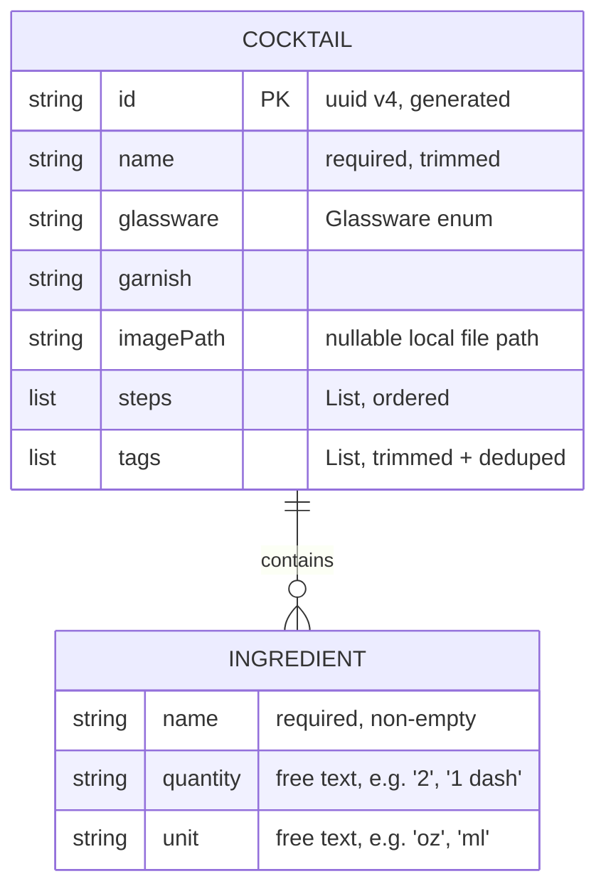

## Cocktail Library with local storage - Standard

## Overview

Build the first vertical slice of the Membar cocktail app: a **local-first Cocktail
Library** with full CRUD. The user can browse a list of saved cocktails, search by name,
filter by tag, view a cocktail's details, and add / edit / delete cocktails. All data is
persisted on-device with no network or account.

This slice establishes the app's layered architecture foundation (data → repository →
business logic → presentation) so later slices — Quiz/Study, Firebase sync, Settings — plug
in without rework. It replaces the Very Good CLI counter scaffold with the real app entry
point.

This plan follows the canonical VGV/bloc layered pattern (the "todos" reference
architecture): an abstract data API in a pure-Dart package, a concrete local-storage
implementation in a Flutter package, a repository that exposes a reactive stream, and a
`CocktailsBloc` driving three screens built with `forui`.

## Problem Statement / Motivation

The repo is a fresh VGV template (`ec72610`) containing only the counter demo. `docs/plan.md`
describes the full app (Library + Quiz + Settings + Firebase sync), which is far too large for
one reviewable PR. The Library is the foundation every other feature depends on — Quiz needs a
populated library to generate questions, and sync needs a persistence contract to sync
against. Shipping the Library first, backed by a clean data/repository seam, de-risks
everything downstream: adding Firebase later is a second `CocktailsApi` implementation, not a
rewrite.

## Proposed Solution

### Architecture (VGV layered)

```text
Presentation   lib/cocktails/view/         CocktailsPage / DetailsPage / EditorPage  (forui)
     │ dispatches events / reads state
Business Logic lib/cocktails/bloc/         CocktailsBloc
     │ calls repository
Repository     packages/cocktails_repository/   CocktailsRepository  (Stream + save/delete)
     │ calls data API
Data           packages/cocktails_api/          CocktailsApi (abstract) + Cocktail model
               packages/local_storage_cocktails_api/  LocalStorageCocktailsApi (shared_preferences)
```

Dependency direction is strictly downward. The Firebase implementation slated for a later
slice is a third data package (`firestore_cocktails_api`) implementing the same
`CocktailsApi` — no upstream layer changes.

**Deliberate simplification (matches the canonical todos architecture):** the `Cocktail` /
`Ingredient` models live in `cocktails_api` and are re-exported by `cocktails_repository`
rather than duplicated as separate data-vs-domain models. For a local-first app with no API
schema to insulate against, a second model + transformation layer is speculative
YAGNI. When the Firestore source lands and its wire shape diverges, introduce a repository
domain model then. (Caveat: the re-exported model carries `json_serializable`
`toJson`/`fromJson` — a serialization concern that leaks up through the re-export. Keep
business logic off this model so the seam stays clean when a domain model is eventually split
out.)

### Data model (ERD)



`Glassware` is an enum (`rocks`, `coupe`, `highball`, `martini`, `nickAndNora`, `flute`,
`tiki`, `other`) serialized by name; unknown values decode to `other`.

### Storage

`LocalStorageCocktailsApi` persists the entire library as one JSON string under a
`shared_preferences` key and publishes changes through an `rxdart` `BehaviorSubject` rather than
a plain `StreamController`: a `BehaviorSubject` replays the current list to any late subscriber
(e.g. the bloc re-subscribing after a hot restart in dev, or a second widget listening after the
first frame) without extra bookkeeping — a broadcast `StreamController` would need a manual
"emit current value on listen" shim to get the same behavior. On construction it reads and seeds
the subject; a corrupt/unparseable blob is caught, reported via `debugPrint`, and recovered as an
empty library (never crashes). Every `saveCocktail`/`deleteCocktail` rewrites the full blob
(O(n)) — acceptable for a personal library; documented as the scaling ceiling that motivates a
real DB later. A failed write (e.g. `shared_preferences` platform error) throws
`CocktailsPersistenceException`. Only an `imagePath` reference is stored, never image bytes.

### Product decisions (locked)

| Decision | Choice |
|----------|--------|
| Images | `imagePath` field exists on the model but nothing populates it this slice — no picker, no manual path field in the editor. It is always `null`, so details/list always render the placeholder. The field stays only so the schema doesn't need a migration when the picker slice lands. |
| Delete UX | `FDialog` confirmation; confirm removes, cancel keeps. No undo snackbar. |
| Duplicate names | Allowed silently. Identity is a UUID, not the name. |
| Default sort | Alphabetical by name, case-insensitive, stable across restarts. |
| Ingredient quantity/unit | Optional free text. Only ingredient `name` is required. |
| Corrupt-data recovery | Start empty; report via `debugPrint` (no logging package added). |
| Navigation | Plain `Navigator` (list → details → editor). `go_router` bottom-nav shell deferred to the app-shell slice. |
| Multi-tag filter | Selecting several tags is OR — a cocktail matches if it has *any* selected tag. That result is then ANDed with the search term. |
| Tag entry | `FMultiSelect<String>` options are the distinct tags already present across the library. New tags are created via a separate plain text field ("add tag") in the editor, trimmed + added to the selection — `FMultiSelect` itself is not used for free-text creation. |

## Technical Considerations

- **Packages:** two are pure Dart (`cocktails_api`, `cocktails_repository`) — scaffold with
  the `very_good_cli` MCP `create` tool as `dart_package`. `local_storage_cocktails_api`
  depends on the `shared_preferences` Flutter plugin, so it is a `flutter_package`. All use
  `path:` dependencies and barrel exports; `src/` is never imported across a package boundary.
- **New dependencies:** `equatable`, `json_annotation`, `uuid` (api); `json_serializable` +
  `build_runner` (api dev); `shared_preferences`, `rxdart` (local storage); and in the root
  app `cocktails_repository`, `local_storage_cocktails_api`, `shared_preferences` (bootstrap
  wiring only). No `fpdart`/`freezed`/`hive` — VGV conventions use `equatable` +
  `json_serializable`. Blocs handle errors with typed exceptions and a `failure` state, not
  `Either`.
- **Bootstrap:** `bootstrap.dart` calls `WidgetsFlutterBinding.ensureInitialized()` **before**
  the async `SharedPreferences.getInstance()` (required — the binding must exist before a
  plugin channel is used), then constructs `LocalStorageCocktailsApi` → `CocktailsRepository`
  inside the `async` builder passed to `bootstrap()`, and provides the repository to `App` via
  a single `RepositoryProvider` (not `MultiRepositoryProvider` — there is one repository). The
  data-package imports (`local_storage_cocktails_api`, `shared_preferences`) appear **only**
  here — never in `lib/cocktails/**` or `lib/app/**`, which reach data solely through the
  repository.
- **forui UI (v0.24.1, verified from package source):** set `MaterialApp.theme:
  theme.toApproximateMaterialTheme()` and wrap `MaterialApp.builder`'s `child` in
  `FTheme(data: theme, child: FToaster(child: FTooltipGroup(child: child!)))`, where `theme =
  FTheme.neutral.light.touch` (there is **no** `FThemes.zinc` catalog in this version). Add
  `FLocalizations.localizationsDelegates`/`supportedLocales` alongside the app's. Screens use:
  `FScaffold` (`header`/`footer`/`child` — **no FAB slot exists**, so the "Add" action is an
  `FHeaderAction(icon: Icon(FIcons.plus))` in the header's `suffixes`); `FHeader` on the list
  screen and `FHeader.nested` (with a back `FHeaderAction` prefix) on details/editor;
  `FTextFormField` + `validator` for the editor form (works inside a plain `Form` +
  `GlobalKey<FormState>`); `FSelect<Glassware>` (map ctor) for glassware; `FMultiSelect<String>`
  (renders selected tags as chips) for tags; `FTileGroup.builder` for the virtualized cocktail
  list (`FTile` rows with `prefix`/`title`/`subtitle`/`suffix` + `onPress`); `FBadge` for inline
  tag/glass labels; and `showFDialog` for the delete confirmation (compose the title + Cancel /
  destructive-Delete buttons manually — `FDialog` has no built-in title/body/actions API).
  Search is a plain `FTextField` with a leading `FIcons.search` prefix and `clearable`, wired to
  a managed control's `onChange`.
- **State shape:** `CocktailsBloc` holds `status` (reflects the repository *subscription* only:
  loading/success/failure of the live list), a separate `saveStatus` for the in-flight
  add/edit/delete operation the editor triggers, plus the full `cocktails` list, `searchTerm`,
  and `activeTags`. The state extends `Equatable`, is immutable, and is updated via `copyWith`.
  Keeping `status` and `saveStatus` distinct prevents a save failure in the
  editor from flashing a spurious failure banner on the list screen (or vice versa) — one bloc
  is still simpler than splitting into an overview bloc + editor bloc for this local-first
  scale, but the two lifecycles must not share one status field. `filteredCocktails` is a
  derived **getter** (never a stored field, so it is excluded from `props`) that applies
  case-insensitive substring search AND tag membership (multiple selected tags are OR'd
  together per the Product decisions table), then alphabetical sort. The subscription event
  uses `emit.forEach` over the repository stream (`restartable`), supplying both `onData` (emit
  the loaded list with `status.success`) and `onError` (emit `status.failure`) so a stream
  error becomes a failure state rather than an unhandled exception; save/delete events use
  `sequential` (via `bloc_concurrency`) so a rapid delete-then-save can't interleave.
  Persistence failures on save/delete surface as a single `CocktailsPersistenceException`
  thrown by `LocalStorageCocktailsApi`, caught by the bloc into `saveStatus.failure` — the
  repository does not wrap or translate it, matching the todos reference's pass-through
  behavior.
- **Bloc provisioning across routes:** the single `CocktailsBloc` instance backs all three
  screens. `CocktailsPage` (the home route) creates it with `BlocProvider`. Because
  details/editor are pushed with plain `Navigator` — whose root sits *above* that provider —
  each pushed `MaterialPageRoute` builder must wrap its page in
  `BlocProvider.value(value: context.read<CocktailsBloc>(), child: ...)` so the same instance
  resolves; otherwise the pushed routes throw `ProviderNotFoundException`. This shared instance
  is precisely how the editor observes `saveStatus` and pops itself on save success.
- **Editor safety:** the editor is a `StatefulWidget` that owns and `dispose()`s every
  `TextEditingController` / `FocusNode` (name, garnish, add-tag, and each dynamic
  ingredient/step row — rows dispose their controllers when removed). A `PopScope` compares
  current form state to the initial snapshot and prompts "Discard changes?" only when dirty;
  add-mode vs edit-mode messaging differs. A `BlocListener` on `saveStatus` pops on
  `success` and surfaces an error on `failure` (keeping the user on the editor). Empty
  ingredient rows and empty steps are stripped, tags trimmed + case-folded deduped before save.
  A widget test exercises add-then-remove of ingredient rows to guard against controller leaks.
- **Test harness:** update `test/helpers/pump_app.dart` to mirror the real app tree — wrap the
  widget under test in `FTheme(data: FTheme.neutral.light.touch, child: FToaster(child:
  FTooltipGroup(child: ...)))` inside the `MaterialApp`, and add `FLocalizations` delegates.
  `context.theme` has a safe fallback so tests render without it, but mirroring the app avoids
  light/dark and toast/tooltip divergence. `showFDialog`/`showFSheet` assert a `MaterialApp`
  ancestor, so delete-confirmation widget tests must pump through `pumpApp`, not a bare wrapper.
- **Coverage:** VGV 100% line coverage. Every bloc, repository, api, model, and view gets a
  test. Pure-Dart packages run under `dart test`; Flutter package and app under `flutter test`.
  Generated `*.g.dart` files are excluded via a `# coverage:ignore-file` pragma at the top of
  each generated file, so coverage numbers reflect hand-written code only.
- **l10n:** all user-facing strings added to `lib/l10n/arb/app_en.arb` and `app_es.arb`
  (mirror keys); no hard-coded UI strings. Regenerate with `flutter gen-l10n`.
- **Cleanup:** remove `lib/counter/` and its tests; repoint `App.home` and update
  `test/app/view/app_test.dart`.

## Implementation Phases

Phase boundaries follow the layer seams so the codebase compiles and its tests pass after each
phase. Each phase is independently committable.

### Phase 1: cocktails_api data package

- **Status:** Not started
- **Scope:** Pure-Dart package with the `Cocktail` + `Ingredient` models (`equatable` +
  `json_serializable`, uuid-generated id), the `Glassware` enum, the abstract `CocktailsApi`,
  and the `CocktailNotFoundException` / `CocktailsPersistenceException` exceptions.
- **Files touched:** `packages/cocktails_api/pubspec.yaml`,
  `packages/cocktails_api/lib/cocktails_api.dart` (barrel),
  `packages/cocktails_api/lib/src/cocktails_api.dart`,
  `packages/cocktails_api/lib/src/models/{models.dart,cocktail.dart,ingredient.dart,glassware.dart}`,
  generated `*.g.dart`, `packages/cocktails_api/test/**`.
- **Acceptance criteria:** models round-trip through `toJson`/`fromJson`, id auto-generates,
  unknown glassware decodes to `other`; 100% coverage.
- **Validation:** `cd packages/cocktails_api && dart pub get && dart run build_runner build --delete-conflicting-outputs && dart analyze && dart test`

### Phase 2: local_storage_cocktails_api data package

- **Status:** Not started
- **Scope:** Flutter package implementing `CocktailsApi` over `shared_preferences` with an
  `rxdart` `BehaviorSubject`; seeds from storage on init, recovers from a corrupt blob as
  empty, rewrites the full JSON blob on save/delete.
- **Files touched:** `packages/local_storage_cocktails_api/pubspec.yaml`,
  `.../lib/local_storage_cocktails_api.dart` (barrel),
  `.../lib/src/local_storage_cocktails_api.dart`, `.../test/**`.
- **Acceptance criteria:** save then read re-emits the updated list; delete of a missing id
  throws `CocktailNotFoundException`; a `shared_preferences` write failure throws
  `CocktailsPersistenceException`; a corrupt stored blob yields an empty stream without
  throwing; 100% coverage (seed via `SharedPreferences.setMockInitialValues`, not a mocktail
  mock of the prefs surface).
- **Validation:** `cd packages/local_storage_cocktails_api && flutter pub get && flutter analyze && flutter test`

### Phase 3: cocktails_repository package

- **Status:** Not started
- **Scope:** Pure-Dart repository wrapping a `CocktailsApi` (constructor-injected), exposing
  `getCocktails() → Stream<List<Cocktail>>`, `saveCocktail`, `deleteCocktail`; re-exports the
  models via barrel.
- **Files touched:** `packages/cocktails_repository/pubspec.yaml`,
  `.../lib/cocktails_repository.dart` (barrel), `.../lib/src/cocktails_repository.dart`,
  `.../test/**`.
- **Acceptance criteria:** each method delegates to the injected api (verified with a mock);
  models re-exported; 100% coverage.
- **Validation:** `cd packages/cocktails_repository && dart pub get && dart analyze && dart test`

### Phase 4: CocktailsBloc + repository bootstrap

- **Status:** Not started
- **Scope:** Implement `CocktailsBloc` (immutable `Equatable` state with `status`/`saveStatus`,
  `copyWith`, derived `filteredCocktails` getter; `emit.forEach` `restartable` subscription with
  `onData`/`onError`; `sequential` save/delete via `bloc_concurrency`) with full unit coverage.
  Bootstrap the data stack in `bootstrap.dart` — `WidgetsFlutterBinding.ensureInitialized()` →
  `SharedPreferences.getInstance()` → `LocalStorageCocktailsApi` → `CocktailsRepository` — and
  expose the repository via a single `RepositoryProvider` in `App`. **No screens yet:** the
  counter remains the temporary home so the app still compiles, runs, and passes tests.
- **Files touched:** `lib/cocktails/cocktails.dart` (barrel — bloc exports),
  `lib/cocktails/bloc/{cocktails_bloc.dart,cocktails_event.dart,cocktails_state.dart}`,
  `lib/bootstrap.dart` (repository wiring), `lib/app/view/app.dart` (add `RepositoryProvider`),
  root `pubspec.yaml` (path deps on `cocktails_repository` + `local_storage_cocktails_api` +
  `shared_preferences`; pin `forui: ^0.24.1`); add `test/cocktails/bloc/**`.
- **Acceptance criteria:** `CocktailsBloc` unit tests (`blocTest`, mocked `CocktailsRepository`)
  cover subscription success/failure, save success/failure, delete, search, tag-filter, and
  alphabetical ordering; the app still boots (counter home); 100% bloc coverage.
- **Validation:** `flutter pub get && flutter analyze && flutter test`

### Phase 5: cocktails screens + l10n + counter removal

- **Status:** Not started
- **Scope:** The three `forui` screens (`CocktailsPage`/`CocktailsView`, details, editor) plus
  widgets, `FTheme` setup in `App` (`toApproximateMaterialTheme()` + `MaterialApp.builder`
  wrap), `BlocProvider` for `CocktailsBloc` at the home route and `BlocProvider.value` on pushed
  routes, l10n strings in both ARBs, and removal of the counter feature (repoint `App.home` to
  `CocktailsPage`).
- **Files touched:**
  `lib/cocktails/view/{cocktails_page.dart,cocktails_view.dart,cocktail_details_page.dart,cocktail_editor_page.dart}`,
  `lib/cocktails/widgets/**` (`cocktail_tile.dart`, `cocktail_image.dart`,
  `ingredient_row_field.dart`), `lib/cocktails/cocktails.dart` (add view exports),
  `lib/app/view/app.dart` (`FTheme` + home), `lib/l10n/arb/{app_en,app_es}.arb`; **delete**
  `lib/counter/**`, `test/counter/**`; update `test/app/view/app_test.dart` and
  `test/helpers/pump_app.dart` (mirror the forui wrapping); add `test/cocktails/{view,widgets}/**`.
- **Acceptance criteria:** all success criteria below pass; the counter demo is gone; app boots
  to the Library; 100% coverage.
- **Validation:** `flutter pub get && flutter gen-l10n && flutter analyze && flutter test`

## Success Criteria

```success-criteria
GOAL: A local-first Cocktail Library ships with full CRUD, search, and tag filtering over a VGV-layered data→repository→bloc→forui stack, replacing the counter scaffold.

SUCCESS CRITERIA:
- Static analysis is clean across the app and all three packages | verify: flutter analyze && cd packages/cocktails_api && dart analyze && cd ../local_storage_cocktails_api && flutter analyze && cd ../cocktails_repository && dart analyze
- Code is formatted | verify: dart format --output=none --set-exit-if-changed .
- cocktails_api: models round-trip toJson/fromJson, auto-generate a uuid id, and decode unknown glassware to `other` | verify: cd packages/cocktails_api && dart test
- local_storage_cocktails_api: save re-emits the updated list on the stream, deleting a missing id throws CocktailNotFoundException, and a corrupt stored blob recovers as an empty library without throwing | verify: cd packages/local_storage_cocktails_api && flutter test
- cocktails_repository: getCocktails/saveCocktail/deleteCocktail delegate to the injected CocktailsApi | verify: cd packages/cocktails_repository && dart test
- App + bloc + widget tests pass the following, each independently verified | verify: flutter test
  - Empty-library state renders
  - No-search-results state is distinct from empty-library
  - Tag filter control is absent when no tags exist
  - Blank-name save is blocked with an inline validation error
  - A saved cocktail appears in the list without an app restart
  - Editing pre-fills all fields from the existing cocktail
  - Empty ingredient rows and empty step rows are stripped before save
  - Tags are trimmed and deduped (case-folded) before save
  - Delete requires confirmation via `FDialog`; cancel keeps the cocktail
  - A dirty editor prompts "Discard changes?" on back; a clean editor does not
  - Search narrows the list case-insensitively by name
  - Multiple selected tags OR together, then AND with the search term
  - A save failure keeps the user on the editor and surfaces the error
  - A missing or broken `imagePath` renders the placeholder (always, this slice)
  - The list is sorted alphabetically and built lazily (`FTileGroup.builder`)
- The counter feature is removed | verify: test ! -d lib/counter && test ! -d test/counter
- All user-facing strings are localized (no analyzer l10n warnings after generation) | verify: flutter gen-l10n && flutter analyze
- Persisted data survives an app restart with all fields intact | verify: manual 1) run `flutter run --flavor development --target lib/main_development.dart` 2) add a cocktail with ingredients, steps, glassware, garnish, and tags 3) fully kill the app 4) relaunch 5) open the cocktail's details and confirm every field matches

NON-GOALS:
- Quiz / Study feature (matching, flashcards, multiple-choice)
- Firebase / cloud sync and account management
- Settings screen
- go_router bottom-navigation shell
- Image picking from gallery/camera (only the imagePath field + placeholder rendering are in scope)
- Undo-on-delete, duplicate-name blocking, and full-text search beyond name

VERIFICATION COMMAND: flutter pub get && flutter gen-l10n && dart format --output=none --set-exit-if-changed . && flutter analyze && flutter test && (cd packages/cocktails_api && dart pub get && dart run build_runner build --delete-conflicting-outputs && dart analyze && dart test) && (cd packages/local_storage_cocktails_api && flutter pub get && flutter analyze && flutter test) && (cd packages/cocktails_repository && dart pub get && dart analyze && dart test)
```

## Dependencies & Risks

- **forui API drift:** widget names and wiring above were verified against the **resolved
  `forui 0.24.1`** source (per `pubspec.lock`), not the live docs — forui.dev may describe a
  newer version with a different theme catalog (e.g. `FThemes.zinc`, absent in 0.24.1). forui
  is pre-1.0. **Pin `forui: ^0.24.1`** in `pubspec.yaml` (currently `any`) so `pub get` can't
  silently drift the API out from under this plan.
- **`json_serializable` + `build_runner`:** first codegen in the repo; ensure generated
  `*.g.dart` are committed and excluded from coverage/format as needed.
- **`shared_preferences` scaling:** whole-library-as-one-blob rewrites are O(n) per save and
  cap practical library size. Acceptable for a personal app; the `CocktailsApi` seam lets a
  real DB (drift/isar) or Firestore replace it later without touching upstream layers.
- **Coverage on views:** the editor's dynamic ingredient rows and `PopScope` discard flow need
  deliberate widget tests to hit 100%.
- **Data-layer dependency in app:** the app takes direct `path` deps on
  `local_storage_cocktails_api` + `shared_preferences` for bootstrap wiring only (the sanctioned
  VGV bootstrap exception) — business logic and presentation still reach data only through the
  repository.

## References & Research

- Full app spec (scope source): `docs/plan.md`
- VGV layered architecture — `layered-architecture` skill (four-layer packages, barrel
  exports, constructor injection, bootstrap wiring)
- Canonical reference architecture: bloc "Flutter Todos" tutorial (abstract API +
  local-storage impl + repository + bloc), https://bloclibrary.dev/tutorials/flutter-todos/
- Existing patterns to mirror: `lib/counter/cubit/counter_cubit.dart`,
  `lib/counter/view/counter_page.dart` (Page/View split, `context.select`),
  `test/counter/cubit/counter_cubit_test.dart` (`blocTest`), `test/helpers/pump_app.dart`
- forui components: https://forui.dev/docs (FScaffold, FHeader, FButton, FTextFormField,
  FLabel, FCard, FTile/FTileGroup, FSelect, FDialog) and forui.dev/docs/llms.txt
- `shared_preferences`: https://pub.dev/packages/shared_preferences · `rxdart`
  `BehaviorSubject`: https://pub.dev/packages/rxdart · `uuid`: https://pub.dev/packages/uuid
