## Add schema-driven recipe libraries - Standard

> Supersedes `docs/plan/2026-07-21-feat-cocktail-library-plan.md`, which is deleted by this
> plan. Decision record: `docs/brainstorm/2026-08-11-recipe-libraries-brainstorm-doc.md`.
> This is **PR1 of two**; the library manager and schema editor ship in PR2.

## Overview

Membar becomes a **multi-library recipe app** rather than a cocktail app. A library is a named
collection that declares its own **field schema**; every recipe shares a common core (name,
ingredients, steps, tags, notes) and additionally carries values for the fields its
library declares. A cocktail has *Glassware* and *Garnish*; a pour-over has *Brew method*,
*Dose*, *Water temp*, *Grind*, and *Tasting notes* — from the same model, the same bloc, and the
same screens.

The consequence is that **the recipe editor is generated from data**: it renders the built-in
core fields, then one control per field in the active library's schema. CRUD, search, and tag
filtering operate identically across every library.

This PR delivers the whole vertical slice **except schema authoring**: the data stack, the
header library switcher, and full recipe CRUD with a dynamically-rendered editor. Libraries are
seeded on first run from two built-in templates (Cocktails, Coffee) and are not yet editable.
PR2 adds the library manager and the schema editor on top, purely additively.

## Problem Statement / Motivation

`lib/` is still the Very Good CLI counter scaffold — nothing is implemented. The superseded
cocktail plan hard-coded the domain: a `Cocktail` model with `glassware`/`garnish` columns, a
`Glassware` Dart enum, `cocktails_*` packages, and a `CocktailsBloc`. Its **architecture**
(abstract data API → local-storage implementation → repository → bloc → forui screens) is
correct and survives untouched; only its *model* and naming do not.

Building the cocktail-specific model first would guarantee rewriting three packages, the bloc,
and every screen the moment a second domain appears — plus a migration for any cocktails saved
in the meantime. Since nothing is built yet, that cost is avoidable entirely by making the model
generic now.

Shipping PR1 without the schema editor keeps this PR roughly the size of the superseded plan and
therefore reviewable, and it forces the dynamic form renderer to be built and tested against two
genuinely different real schemas before any schema-editing UI sits on top of it.

## Proposed Solution

### Invariants

Four rules collapse most of the edge cases in this design. Everything else is detail work.

1. **A recipe carries `libraryId`; recipes are one flat list.** Not `Map<libraryId, List<Recipe>>`.
   "Recipes in library X" is a filter the bloc needs anyway, it keeps the whole-blob rewrite
   simple, and it leaves moving a recipe between libraries as a one-field change later.
2. **Blank means absent, and unknown keys survive.** The editor strips blank values before save
   and writes `existing.fieldValues` **overlaid** with the edited ones — never a fresh map built
   from the rendered controls. Building fresh would silently delete any value whose field is not
   in the current schema. (PR2's field deletion purges such values *deliberately*; PR1 must never
   purge *incidentally*.) `{}`, `{f1: null}`, and `{f1: ''}` must not be three ways to say the
   same thing, or the editor's dirty check fires on an untouched recipe.
3. **The editor binds to the library id passed at push time**, never to `state.activeLibraryId`.
   The switcher renders only on the list screen; details and editor use `FHeader.nested` with a
   back action. This kills the entire class of "schema changed out from under an open form" bugs.
4. **PR1 can never reach a zero-library state.** There is no library-creation UI in PR1, so an
   empty switcher is an unrecoverable app. Seeding is driven by an explicit stored schema-version
   key, and a corrupt libraries blob re-seeds rather than recovering as empty.

### Architecture (VGV layered)

```text
Presentation   lib/recipes/view/                RecipesPage / RecipeDetailsPage / RecipeEditorPage
     │ dispatches events / reads state          lib/recipes/widgets/  (dynamic field controls)
Business Logic lib/recipes/bloc/                RecipesBloc
     │ calls repository
Repository     packages/recipes_repository/     RecipesRepository (Stream<RecipesSnapshot> + mutations)
     │ calls data API
Data           packages/recipes_api/            RecipesApi (abstract) + models + built-in templates
               packages/local_storage_recipes_api/  LocalStorageRecipesApi (shared_preferences)
```

Dependency direction is strictly downward. A future Firestore source is a third data package
implementing the same `RecipesApi` — no upstream layer changes.

**Deliberate simplification (matches the canonical bloc "todos" architecture):** the models live
in `recipes_api` and are re-exported by `recipes_repository` rather than duplicated as separate
data-vs-domain models. For a local-first app with no wire schema to insulate against, a second
model plus a transformation layer is speculative. Keep business logic off these models so the
seam stays clean if a domain model is eventually split out.

### Data model (ERD)

```mermaid
erDiagram
    LIBRARY ||--o{ FIELD_DEFINITION : declares
    LIBRARY ||--o{ RECIPE : contains
    RECIPE ||--o{ INGREDIENT : lists
    RECIPE ||--o{ FIELD_VALUE : "holds (Map keyed by field id)"
    FIELD_DEFINITION ||--o{ FIELD_VALUE : "typed by"

    LIBRARY {
        string id PK "uuid v4, generated"
        string name "required, trimmed"
        list fields "List<FieldDefinition>, render order = list order"
    }
    FIELD_DEFINITION {
        string id PK "uuid v4, generated — values key off this, never the label"
        string label "required, trimmed"
        string type "FieldType: text | select | number | longText"
        bool required "blocks save when empty"
        list options "List<String>, select only, non-empty for select"
        string unit "number only, nullable, e.g. 'g', '°C'"
    }
    RECIPE {
        string id PK "uuid v4, generated"
        string libraryId FK "owning library"
        string name "required, trimmed"
        list steps "List<String>, ordered"
        list tags "List<String>, trimmed + case-folded deduped"
        string notes "free text, may be empty"
        map fieldValues "Map<String fieldId, Object? value>"
    }
    INGREDIENT {
        string name "required, non-empty"
        string quantity "free text, e.g. '2', '1 dash'"
        string unit "free text, e.g. 'oz', 'ml'"
    }
```



**`Glassware` stops being a Dart enum.** It is the option list of a Select field in the Cocktails
template. The app has no compile-time knowledge of any domain.

**`fieldValues` is `Map<String, Object?>`** — `String` for `text`/`select`/`longText`, `num` for
`number`. Storing a real number (rather than its string form) is what leaves room for range
filters and sorting later, and `Map<String, dynamic>` serializes through `json_serializable`
without a custom converter. The invariant is enforced at the single write site (the editor's
save path) and defended on read by two typed helpers on `Recipe`:

```dart
// packages/recipes_api/lib/src/models/recipe.dart
String? textValue(String fieldId);   // null when absent, empty, or not a String
num? numberValue(String fieldId);    // null when absent; falls back to num.tryParse for a
                                     // String value written by a hand-edited blob
```

**Read numbers as `num`, never as `double`.** JSON has no int/double distinction: `92.0`
serializes to `92` and decodes back as `int`, so `value as double` throws. `numberValue` returns
`num?` and callers use `.toDouble()` when they need one. A whole-number round trip is an explicit
test case in Phase 1.

`Recipe`'s constructor **normalizes `fieldValues`**: entries whose value is `null`, or an empty /
whitespace-only `String`, are dropped. This makes "absent" the single representation of no value
across storage, the details screen, and the editor's dirty check.

`Equatable` compares `List` and `Map` props deeply (`DeepCollectionEquality`), so
`fieldValues`, `tags`, `steps`, and `ingredients` behave correctly in `props` with no extra work.

`FieldDefinition` is **one class with nullable `options` and `unit`**, not a sealed hierarchy per
type — `json_serializable` handles it trivially, and PR2's schema editor mutates one type rather
than migrating a value between subclasses. Its constructor asserts the type-conditional
contract: `options` is non-null, non-empty, and duplicate-free exactly when `type == select`
(duplicates would collide in `FSelect`'s `Map<String, T> items`, and a required Select with no
options would make a recipe unsavable); `unit` is null unless `type == number`.

A Select value is stored as the **raw option string**, not an option id. That is the right call
for PR1 — an id-per-option is a second uuid layer for no PR1 benefit — but it is a knowing
exception to the "key by id, never by label" rule that governs field ids. Consequence to carry
into PR2: renaming a Select option must be a rename-and-migrate operation, not a plain edit.

### Built-in templates

`recipes_api` exposes template **builders** — each call returns a `Library` with freshly
generated uuids, so a seeded library is indistinguishable from a hand-built one afterwards:

```dart
// packages/recipes_api/lib/src/templates/library_templates.dart
class LibraryTemplates {
  const LibraryTemplates({String Function() idBuilder = _uuidV4});
  Library cocktails();  // Glassware (select), Garnish (text)
  Library coffee();     // Brew method (select), Dose (number, g), Water temp
                        // (number, °C), Grind (text), Tasting notes (longText)
  List<Library> all();  // [cocktails(), coffee()]
}
```

The id generator is **constructor-injected**, not a static call. Seeded field ids are runtime
uuids, so without injection no test or fixture can name a template's Glassware field — every
seeding, storage, and editor test would have to discover ids by label at runtime. Injecting a
counter-backed `idBuilder` in tests makes them readable and deterministic; production uses the
uuid default.

Template names and field labels are **deliberately not localized** — they become user data the
instant they are seeded. See the l10n bullet under Technical Considerations for the full
reasoning and for why PR1 therefore ships English only.

The Coffee template's `Tasting notes` (LongText) deliberately sits alongside the core `Notes`
field. A coffee log plausibly wants both — scratch notes about the bag or the grinder, and a
separate record of how the cup actually tasted — and it is the only seed data that exercises a
`longText` schema control. Two multiline fields on one screen is the accepted cost, and it is
exactly the kind of thing PR2 lets the user resolve for themselves.

### Storage

`LocalStorageRecipesApi` holds a single `rxdart` `BehaviorSubject<RecipesSnapshot>` seeded on
construction. A `BehaviorSubject` replays the current snapshot to a late subscriber (the bloc
re-subscribing after a hot restart) without a manual "emit current value on listen" shim.

`RecipesSnapshot` is one immutable `Equatable` value: `libraries`, `recipes`, and a **non-null**
`String activeLibraryId`. Non-null is guaranteed by invariant 4 plus the stale-id fallback below —
in PR1 there is always at least one library, so there is always an active one, and the bloc never
has to render a "no library" branch. PR2, which can delete the last library, is what makes this
nullable; the change is one field and one branch, and paying it now would mean writing an
unreachable empty state today.
One subject rather than three separate streams means the bloc has one subscription, one status
field, and one failure path — the three collections are always mutually consistent by
construction, which is exactly what the list screen needs (a recipe list is meaningless without
the library that describes it).

Four `shared_preferences` keys back it: `__schema_version_key__`, `__libraries_key__`,
`__recipes_key__`, `__active_library_id_key__`. Every mutation rewrites the affected key in full
(O(n)) and emits a new snapshot — acceptable at personal scale, documented as the ceiling that
motivates a real DB later.

**Seeding is driven by the schema-version key, not by the libraries key.** On construction, an
absent `__schema_version_key__` means first run: write `LibraryTemplates.all()`, set the active
library to Cocktails, and write `schemaVersion = 1`. Using the version key rather than "libraries
list is empty or absent" is what lets PR2's *delete the last library* coexist with PR1's
*re-seed a corrupt blob* — otherwise a deliberately emptied library list resurrects on next
launch. The field costs nothing now and cannot be retrofitted once PR2 is editing schemas.

**Corrupt-blob recovery is per key**, so one bad key does not destroy the others:

| Key | Unparseable | Valid but empty |
|-----|-------------|-----------------|
| libraries | Re-seed from templates (invariant 4 — an empty switcher is an unrecoverable app) | Preserved (a deliberate PR2 state; unreachable in PR1) |
| recipes | Recover as an empty list, libraries left intact | Normal |
| active library id | Fall back per the rule below | Fall back per the rule below |

All recovery paths report and never throw, through a constructor-injected
`void Function(String) onRecoveryError` defaulting to `debugPrint`. Injecting it rather than
calling `debugPrint` directly makes the recovery branches assertable without overriding the
global `debugPrint` hook in `setUp`, and leaves a seam for a real logger later. A **write**
failure throws `RecipesPersistenceException`.

**Stale active-library id.** If the stored id resolves to no library — a partial write, a corrupt
recovery, or a PR2 deletion — the **storage layer** falls back to the first library in seed order
and rewrites the preference. This rule lives in exactly one place: the bloc's `activeLibrary`
getter is a plain lookup that can only return `null` before the first snapshot arrives. Putting a
second fallback in the bloc would mean two rules that drift, and the bloc cannot rewrite the
preference anyway.

**Seeding timing and seed-write failure.** Seeding happens on the api's construction path: it
composes the seeded snapshot in memory, seeds the `BehaviorSubject` **synchronously** so no empty
frame renders, then writes once. If that write fails, the api **reports through
`onRecoveryError` and keeps running on the in-memory snapshot** — it does not throw (which would
crash `bootstrap()` before `runApp`) and it does not surface a failure state. The app is fully
usable; the only consequence is that the seed is not yet on disk, and because every mutation
rewrites the whole key, the first recipe the user saves persists everything. A failure state with
a retry button would be a worse trade: it blocks a working app on a condition that heals itself.

**A recipe whose `libraryId` matches no library** is hidden from every list, never deleted, and
reported once via `debugPrint`. Silently deleting a user's data to tidy up a dangling reference
is never the right trade.

### API surface

```dart
// packages/recipes_api/lib/src/recipes_api.dart
abstract class RecipesApi {
  Stream<RecipesSnapshot> watch();
  Future<void> saveRecipe(Recipe recipe);
  Future<void> deleteRecipe(String id);
  Future<void> setActiveLibraryId(String id);
  Future<void> close();
}
```

`watch()` returns a **plain `Stream`**, not a `ValueStream` — replay-on-subscribe is
`LocalStorageRecipesApi`'s implementation detail, not part of the contract, which is what keeps
`rxdart` out of `recipes_api` and out of `recipes_repository`.

`close()` is not optional. `LocalStorageRecipesApi` implements it as `_subject.close()` and
`RecipesRepository` forwards it. Without it every api constructed in a test's `setUp` leaks a
subject for the life of the file — and Phase 2 constructs two in a single test. The **app** never
calls it: the repository lives for the process lifetime, which is the sanctioned exception.

`saveLibrary` / `deleteLibrary` are **not** in PR1 — nothing but seeding writes a library, and
seeding is internal to the local-storage implementation. PR2 adds them when the manager needs
them.

### Product decisions (locked)

| Decision | Choice |
|----------|--------|
| First run | Seeds **both** Cocktails and Coffee. PR1 has no library manager, so a fresh install must arrive with something to switch between — and two different schemas is what proves the dynamic editor. |
| Search & tag filter scope | **Active library only**, and **name only** — search does not reach ingredient names, notes, or schema values. Matches the switcher's mental model and keeps the bloc state flat. Global and full-text search are later slices. |
| Switching library | Clears `searchTerm` and `activeTags`, and the list subtree carries a `ValueKey(activeLibraryId)` so forui's managed search control and the scroll position reset with it. A tag filter carried into a library that never had that tag would strand the user on "No results" with chips that cannot match. Selecting the already-active library is a no-op. |
| Field ordering on screen | `name` → schema fields → ingredients → steps → tags → notes. Details mirrors the editor exactly; both take schema fields in schema list order. |
| Empty-library state | Names the active library ("No recipes in Cocktails yet") and carries a primary "Add recipe" button — the header `+` is too weak an affordance to be the only one on a blank screen. The button arrives in Phase 6 with the editor it opens. Seeded libraries ship with **no** sample recipes. |
| Required fields | `FieldDefinition.required` exists now and the editor enforces it. Adding it in PR2 would need a stored-JSON migration. |
| Library icon / emoji | Not modelled. The switcher shows names only. |
| Schema field order (model) | Schema list position *is* the order. No `order` index until PR2 ships drag-to-reorder. |
| Field type | Immutable after creation (enforced in PR2's editor; PR1 has no way to change one). |
| Images | The list tile and details reserve an image slot that **always renders the placeholder**. `Recipe` carries **no** `imagePath` field: nothing would populate it this slice, and adding a nullable field later needs no migration (`json_serializable` decodes a missing key as `null`). The layout work ships now; the field ships with the picker. |
| Delete UX | `showFDialog` confirmation; confirm removes, cancel keeps. No undo. |
| Duplicate names | Allowed silently. Identity is a uuid. |
| Default sort | Alphabetical by name, case-insensitive, stable across restarts. |
| Ingredient quantity/unit | Optional free text. Only ingredient `name` is required. |
| Navigation | Plain `Navigator` (list → details → editor). `go_router` shell deferred to the app-shell slice. |
| Multi-tag filter | Selected tags OR together; that result ANDs with the search term. |
| Tag entry | `FMultiSelect<String>` options are the distinct tags already in the **active library**. New tags come from a separate plain "add tag" text field, trimmed and added to the selection. |

## Technical Considerations

- **Packages:** `recipes_api` and `recipes_repository` are pure Dart (`dart_package`);
  `local_storage_recipes_api` depends on the `shared_preferences` Flutter plugin so it is a
  `flutter_package`. Scaffold all three with the `very_good_cli` MCP `create` tool. All use
  `path:` dependencies and barrel exports; `src/` is never imported across a package boundary.
  - **`public_member_api_docs` stays enabled in the three packages, so every public member needs
    a doc comment.** The root `analysis_options.yaml` turns the rule off, but that file does not
    apply under `packages/**` — each scaffolded package includes
    `package:very_good_analysis/analysis_options.yaml`, which enables the rule
    (`analysis_options.10.3.0.yaml:160`). Without doc comments, Phase 1's own `dart analyze`
    validation fails on ~100 lints before a single test runs. This is a decision, not an
    accident: these packages have published-library shape, so they carry docs.
  - **`shared_preferences`: use the legacy `SharedPreferences.getInstance()` API deliberately.**
    Its synchronous read cache is what makes seeding the subject synchronously possible.
    `SharedPreferencesAsync` / `SharedPreferencesWithCache` make every read a `Future` and would
    force an empty first frame.
- **CI:** `.github/workflows/main.yaml` currently has a single root `build` job, so the three new
  packages — the entire data layer — would be tested only locally. Add one job per package:
  `dart_package.yml@v1` for `recipes_api` and `recipes_repository`, `flutter_package.yml@v1`
  (with `flutter_version: "3.44.x"`) for `local_storage_recipes_api`, each with the matching
  `working_directory`. Also add a `pub` entry per package directory to `.github/dependabot.yaml`,
  which today watches only `/`.
- **Spell check:** the `spell-check` job runs cspell over `**/*.md` with
  `modified_files_only: false`, so it checks this plan and the brainstorm doc too. Add the new
  vocabulary (`forui`, `rxdart`, `mocktail`, `Glassware`, `uuid`, `Equatable`, `lcov`, `puro`,
  and the template terms) to `.github/cspell.json`, whose word list currently holds only the
  counter scaffold's Spanish terms.
- **New dependencies:** `equatable`, `json_annotation`, `uuid` (api); `json_serializable` +
  `build_runner` (api dev); `shared_preferences` + `rxdart` (local storage — the abstract
  contract returns a plain `Stream<RecipesSnapshot>`, so `BehaviorSubject` is an implementation
  detail of the local-storage package and `recipes_api` must not depend on `rxdart`); and in the
  root app
  `recipes_repository`, `local_storage_recipes_api`, `shared_preferences`, plus
  `bloc_concurrency`. No `fpdart`/`freezed`/`hive` — VGV conventions use `equatable` +
  `json_serializable`, and blocs signal errors with typed exceptions and a failure state, not
  `Either`. **Pin `forui: 0.24.1`** exactly (currently `any`) — see Dependencies & Risks.
- **Bootstrap:** `bootstrap.dart` keeps only `WidgetsFlutterBinding.ensureInitialized()` (the
  binding must exist before a plugin channel is used). The **three flavor entrypoints** —
  `lib/main_development.dart`, `main_staging.dart`, `main_production.dart` — each `await
  SharedPreferences.getInstance()`, construct `LocalStorageRecipesApi` → `RecipesRepository`, and
  return `App(recipesRepository: ...)`. The builder passed to `bootstrap()` is defined in those
  files, which is also where VGV puts client and repository construction so flavors can vary
  configuration. The data-package imports therefore appear **only** in the three entrypoints —
  never in `lib/recipes/**` or `lib/app/**`.
- **`App` signature:** `App({required RecipesRepository recipesRepository, super.key})`, wrapping
  its `MaterialApp` in a single `RepositoryProvider.value` (not `MultiRepositoryProvider` — there
  is one repository). This changes `App`'s constructor, so `test/app/view/app_test.dart` must be
  updated in the **same phase** that changes it, or that phase ends with a broken test.
- **forui (v0.24.1, verified against the resolved package source):**
  - `MaterialApp.theme: theme.toApproximateMaterialTheme()` with `theme = FTheme.neutral.light.touch`
    (there is **no** `FThemes.zinc` catalog in this version), and `MaterialApp.builder` wrapping
    its `child` in `FTheme(data: theme, child: FToaster(child: FTooltipGroup(child: child!)))`.
    Add `FLocalizations.localizationsDelegates`/`supportedLocales` alongside the app's.
  - `FScaffold` (`header`/`footer`/`child`) — **no FAB slot exists**, so "Add recipe" is an
    `FHeaderAction(icon: Icon(FIcons.plus))` in the header's `suffixes`.
  - **Library switcher:** `FPopoverMenu(menu: [FItemGroup(children: [...FItem(title:, onPress:,
    suffix: <check on active>)])], child: <tappable header title showing the active library>)`,
    placed as the `FHeader` title on the list screen. PR2 appends a "Manage libraries…" `FItem`.
  - `FTextFormField` for every text-ish control. Its controller goes through
    `control: FTextFieldControl.managed(controller: ...)` — **there is no `controller:`
    parameter**. `keyboardType`, `minLines`, `maxLines`, and `validator` are top-level.
  - `FSelect<String>(items: {for (final o in field.options) o: o}, control:
    FSelectControl.managed(initial: ...), validator: ...)` — `items` maps *label* → value.
  - `FMultiSelect<String>` for tags, `FTileGroup.builder` for the virtualized recipe list,
    `FBadge` for inline tag labels, `showFDialog` for delete confirmation (compose title +
    Cancel / destructive-Delete manually — `FDialog` has no built-in title/body/actions API).
- **Dynamic field controls:** one widget per `FieldType`, chosen by a `switch` on
  `FieldDefinition.type` in `lib/recipes/widgets/schema_field_control.dart`. `text` →
  `FTextFormField`; `longText` → `FTextFormField(minLines: 3, maxLines: 5)`; `number` →
  `FTextFormField(keyboardType: TextInputType.numberWithOptions(decimal: true, signed: false))`
  with the unit rendered in the label; `select` → `FSelect<String>`. An exhaustive `switch` on the
  enum means adding a field type in a later slice is a compile error here rather than a silent
  blank control.
- **Required-field semantics differ per type** and must be stated, or they will be guessed wrong:
  - `text` / `longText` — trim, then require non-empty.
  - `number` — **`0` satisfies required.** Required means *present*, not truthy. Only null and
    unparseable input fail.
  - `select` — a selection must exist. An *optional* Select is `toggleable: true` so the user can
    clear it back to no selection; a *required* one is `toggleable: false`, because clearing it
    would only produce a value the form refuses to save.
- **Number parsing — use `intl`'s `NumberFormat` on both sides**, not bare `num.tryParse`; the app
  already depends on `intl`. Parse with `NumberFormat.decimalPattern(Localizations.localeOf(context)
  .toLanguageTag()).parse(input)` inside a `try`, falling back to `num.tryParse`; format for
  display with the same `NumberFormat`. A parse failure produces an "Enter a number" error
  **distinct from** the required-field error, so the user can tell "you left this blank" from
  "that isn't a number". Any finite value is accepted (reject `NaN`/`Infinity`); there is no range
  check — min/max is a future `FieldDefinition` extension, not something to invent here.
    - Do **not** normalize `,` → `.` by string replacement. It turns the grouped entry `1,234`
      into `1.234`, silently storing 1.234 instead of 1234 — and that is the *English* locale,
      the only one PR1 ships, so this is a live bug, not a hypothetical one.
    - `NumberFormat` renders a whole number as `92` rather than `92.0`, so no hand-rolled
      trailing-`.0` trimmer is needed.
    - Driving both directions off the app locale is also what makes reintroducing Spanish a
      matter of adding an ARB rather than revisiting every Number field.
- **Stale Select value** (not in the current option list): details renders the stored value as-is;
  the editor shows no selection. Nothing further is needed — the overlay save (invariant 2) is
  what guarantees the stale value survives an untouched round trip, so no bespoke "stale value"
  affordance is warranted. This state is unreachable through PR1's UI at all; the dedicated
  treatment belongs in PR2, where editing options makes it routine.
- **Validation feedback:** on a failed `Form.validate()`, scroll to the first invalid field. On a
  generated form the offending control is frequently below the fold, and "Save does nothing" is
  the failure the user actually experiences. `Form.validate()` returns only a bool, so the editor
  keeps an ordered `List<GlobalKey>` — one per field, built alongside the controller maps in
  `initState` — runs each field's validator itself to find the first failure, and calls
  `Scrollable.ensureVisible` on that key's context.
- **Details rendering per type:** `number` renders value + unit; `longText` preserves newlines and
  is not truncated; `select` renders as an `FBadge`, matching the badge treatment for tags; `text`
  renders inline. Fields with no value are **hidden entirely**, and the schema section header is
  suppressed when every schema field is empty. The editor, by contrast, always shows every field —
  that is what keeps an unfilled field discoverable.
- **Events and statuses** (named here so `bloc_lint`, which CI runs, has nothing to argue with —
  `BlocSubject + Noun + VerbPastTense`, sealed base extending `Equatable`):

  ```dart
  sealed class RecipesEvent extends Equatable { const RecipesEvent(); }
  final class RecipesSubscriptionRequested extends RecipesEvent {}
  final class RecipesRecipeSaved extends RecipesEvent { final Recipe recipe; }
  final class RecipesRecipeDeleted extends RecipesEvent { final String id; }
  final class RecipesLibrarySelected extends RecipesEvent { final String libraryId; }
  final class RecipesSearchTermChanged extends RecipesEvent { final String term; }
  final class RecipesTagFilterToggled extends RecipesEvent { final String tag; }

  enum RecipesStatus { initial, loading, success, failure }
  enum RecipesSaveStatus { initial, loading, success, failure }
  ```

- **State shape:** `RecipesBloc` holds `status` (the repository *subscription* only),
  a separate `saveStatus` for the in-flight add/edit/delete, plus `libraries`, `recipes`,
  `activeLibraryId`, `searchTerm`, and `activeTags`. Keeping the two statuses distinct stops a
  save failure in the editor from flashing a spurious banner on the list screen. The state is an
  immutable `Equatable` updated via `copyWith`. `activeLibrary` and `visibleRecipes` are derived
  **getters** (never stored fields, so they stay out of `props`): `visibleRecipes` filters to
  `libraryId == activeLibraryId`, then case-insensitive substring search on name, then tag
  membership (selected tags OR'd), then alphabetical sort. The subscription event uses
  `emit.forEach` over the repository stream (`restartable`) with both `onData` and `onError`, so
  a stream error becomes a failure state rather than an unhandled exception; save/delete/
  set-active events use `sequential` (via `bloc_concurrency`) so a rapid delete-then-save cannot
  interleave. **Both** `RecipesPersistenceException` **and** `RecipeNotFoundException` are caught
  by the bloc into `saveStatus.failure`; the repository passes them through untranslated. Missing
  the second one is not cosmetic: deleting an already-deleted recipe (a double-tap on the confirm
  dialog, or a stale details route) would throw out of the handler, emit no state, and strand
  `saveStatus` on `loading` forever — the editor's `BlocListener` never fires and the user sits on
  a spinner.
- **Bloc provisioning across routes:** one `RecipesBloc` instance backs all three screens.
  `RecipesPage` (the home route) creates it with `BlocProvider`. Because details/editor are
  pushed with plain `Navigator` — whose root sits *above* that provider — each pushed
  `MaterialPageRoute` builder must wrap its page in `BlocProvider.value(value:
  context.read<RecipesBloc>(), child: ...)`, or the pushed route throws
  `ProviderNotFoundException`. This shared instance is how the editor observes `saveStatus` and
  pops itself on save success.
- **Editor safety:** the editor is a `StatefulWidget` that builds its controller maps from the
  schema of the library **passed at push time** (invariant 3) in `initState`, and `dispose()`s
  every `TextEditingController` / `FocusNode` (core fields, each dynamic ingredient/step row, and
  one per schema field). Rows dispose their controllers when removed. A `Map<fieldId,
  TextEditingController>` built in `initState` is sufficient precisely because the schema cannot
  change during the editor's lifetime — PR2 must revisit this if it ever allows editing a schema
  from inside a recipe. A `PopScope` compares current form state to the initial snapshot and
  prompts "Discard changes?" only when dirty, with different add-mode vs edit-mode messaging. A
  `BlocListener` on `saveStatus` pops on `success` and surfaces the error on `failure` while
  keeping the user on the editor.
- **Editor save path** (invariant 2): empty ingredient rows and empty steps are stripped, tags
  trimmed and case-folded deduped, schema fields left blank omitted from `fieldValues` rather than
  stored as `''`, and the result written as `existing.fieldValues` **overlaid** with the edited
  values — never a fresh map built from the rendered controls, which would drop any key whose
  field is absent from the current schema.
- **Test harness:** `test/helpers/pump_app.dart` must provide the dependency scaffolding, not just
  the theme — every screen under test sits below a `RepositoryProvider` and a `BlocProvider`, and
  without injection points each test file rebuilds that inline, which is the anti-pattern
  `pumpApp` exists to prevent:

  ```dart
  Future<void> pumpApp(
    Widget widget, {
    RecipesRepository? recipesRepository,
    RecipesBloc? recipesBloc,
  })
  ```

  wrapping in `RepositoryProvider.value` / `BlocProvider.value` when supplied, inside a
  `MaterialApp` that mirrors the real app tree: `FTheme(data: FTheme.neutral.light.touch, child:
  FToaster(child: FTooltipGroup(child: ...)))` plus the `FLocalizations` delegates. `showFDialog`
  asserts a `MaterialApp` ancestor, so delete-confirmation tests must pump through `pumpApp`.
- **Mocking:** widget tests use `class _MockRecipesBloc extends MockBloc<RecipesEvent,
  RecipesState> implements RecipesBloc {}` with `whenListen`, **never a real bloc** — a real bloc
  over a mocked repository turns every widget test into a slow, brittle integration test and
  duplicates filtering coverage that Phase 4's `blocTest` already owns. Widget tests assert
  rendering and dispatched events; the bloc tests assert filtering. Add
  `setUpAll(() => registerFallbackValue(...))` for `Recipe` and `RecipesEvent`, or
  `verify(() => api.saveRecipe(any()))` fails.
- **Coverage:** VGV 100% line coverage, and it is **enforced** — every phase runs
  `very_good test --coverage --min-coverage 100` (very_good_cli 1.3.0 is installed), not a bare
  `flutter test`, which exits 0 at 40% coverage and would make "100% coverage" a claim no command
  checks. Seed the local storage tests with `SharedPreferences.setMockInitialValues`, not a
  mocktail mock of the prefs surface, and `tearDown` every constructed api with `close()`.
- **Excluding generated code from coverage:** do **not** hand-add `// coverage:ignore-file` to
  `*.g.dart` — those files are regenerated wholesale, so the next
  `build_runner build --delete-conflicting-outputs` (which is Phase 1's own validation command)
  erases it and coverage silently drops. Declare it instead, the way `l10n.yaml` already does for
  generated localizations, via `packages/recipes_api/build.yaml`:

  ```yaml
  targets:
    $default:
      builders:
        source_gen:combining_builder:
          options:
            header: "// coverage:ignore-file"
  ```
- **l10n — PR1 ships English only.** All user-facing **chrome** strings go in
  `lib/l10n/arb/app_en.arb`; no hard-coded UI strings. **`lib/l10n/arb/app_es.arb` is deleted**
  along with the counter scaffold it was written for.
  - The reason is consistency, not laziness. Template names and field labels *cannot* be
    localized at render time — they become user data the moment they are seeded, so resolving
    them through `AppLocalizations` would rename a user's library when they change device
    language and would silently discard a PR2 rename. Keeping `app_es.arb` would therefore ship a
    Spanish device fully localized chrome wrapped around English content ("Cocktails",
    "Glassware", "Brew method") that PR1 gives no way to rename. One locale done properly beats
    two done half-way.
  - Spanish returns once template content can be localized too — either at seed time (inject a
    `TemplateStrings` value into `LibraryTemplates` the way `idBuilder` is injected, freezing the
    strings once at seed time) or simply after PR2's schema editor lets the user rename anything.
  - `flutter_localizations`, `intl`, and the `AppLocalizations` plumbing all stay. Regenerate with
    `flutter gen-l10n`.
- **Cleanup:** remove `lib/counter/` and its tests, repoint `App.home`, update
  `test/app/view/app_test.dart`, delete the superseded
  `docs/plan/2026-07-21-feat-cocktail-library-plan.md`, and add a superseded banner to
  `docs/plan.md` — it still specifies Hive, `fpdart`, `freezed`, and a cocktail-only model, all
  of which contradict the stack this plan locks in.

## Implementation Phases

Phase boundaries follow the layer seams, so the codebase compiles and its tests pass after each
phase. Each phase is independently committable.

**Scope note.** ~2,000–2,800 LOC (source + tests at 100% coverage) across three new packages and
all four layers. That is more than one reviewable PR, and the natural seam is between Phases 4
and 5: Phases 1–4 are invisible to the user (the counter stays home, nothing is wired to a
screen) and reviewable purely on data-modelling and state correctness; Phases 5–6 are the entire
user-visible surface and reviewable purely on UI and interaction. **Decision: keep one plan
with these six phases** rather than splitting into part-N files — `/build` executes one phase per
context window, and the 4/5 boundary is available as a PR seam whenever you want to take it.

### Phase 1: recipes_api data package

- **Status:** Not started
- **Scope:** Pure-Dart package with the `Recipe`, `Ingredient`, `Library`, `FieldDefinition`, and
  `RecipesSnapshot` models (`equatable` + `json_serializable`, uuid-generated ids), the
  `FieldType` enum, the `LibraryTemplates` builders, the abstract `RecipesApi`, and the
  `RecipeNotFoundException` / `RecipesPersistenceException` exceptions.
- **Files touched:** `packages/recipes_api/pubspec.yaml`, `packages/recipes_api/build.yaml`
  (coverage header for generated files), `packages/recipes_api/lib/recipes_api.dart` (barrel),
  `packages/recipes_api/lib/src/recipes_api.dart`,
  `packages/recipes_api/lib/src/models/{models.dart,recipe.dart,ingredient.dart,library.dart,field_definition.dart,field_type.dart,recipes_snapshot.dart}`,
  `packages/recipes_api/lib/src/templates/library_templates.dart`, generated `*.g.dart`
  (committed), `packages/recipes_api/test/**`, `.github/workflows/main.yaml` (per-package jobs),
  `.github/dependabot.yaml` (a `pub` entry per package directory).
- **Acceptance criteria:** every model round-trips through `toJson`/`fromJson` including a
  `fieldValues` map holding both `String` and `num`; a **whole-number** value (`92.0`) survives a
  round trip and is read back through `numberValue` without a cast error; ids auto-generate; an
  unknown `FieldType` decodes to `text`; `Recipe`'s constructor drops null / empty /
  whitespace-only `fieldValues` entries; `textValue`/`numberValue` return `null` for absent,
  empty, and wrong-typed entries and `numberValue` parses a numeric `String`; `FieldDefinition`
  asserts on a Select with null, empty, or duplicate options and on a non-number field carrying a
  unit; `LibraryTemplates` with an injected `idBuilder` yields deterministic ids, and two default
  calls yield distinct ones; every public member carries a doc comment (`public_member_api_docs`
  is enabled here); 100% coverage.
- **Validation:** `cd packages/recipes_api && dart pub get && dart run build_runner build --delete-conflicting-outputs && dart analyze && very_good test --coverage --min-coverage 100`

### Phase 2: local_storage_recipes_api data package

- **Status:** Not started
- **Scope:** Flutter package implementing `RecipesApi` over `shared_preferences` with a single
  `BehaviorSubject<RecipesSnapshot>`: seeds from `LibraryTemplates.all()` when the schema-version
  key is absent, recovers per key from a corrupt blob, rewrites the affected key on every
  mutation, and re-emits the snapshot.
- **Files touched:** `packages/local_storage_recipes_api/pubspec.yaml`,
  `.../lib/local_storage_recipes_api.dart` (barrel),
  `.../lib/src/local_storage_recipes_api.dart`, `.../test/**`.
- **Acceptance criteria:** a first run with empty prefs seeds both templates, sets the active
  library to Cocktails, and writes `schemaVersion = 1`; a second construction over the same prefs
  does **not** re-seed; an explicitly-stored empty libraries list with the version key present is
  preserved rather than re-seeded; the subject is seeded **synchronously** so a subscriber
  attached in the same tick never observes an empty snapshot; save re-emits a snapshot containing
  the updated recipe; deleting a missing id throws `RecipeNotFoundException`;
  `setActiveLibraryId` persists and re-emits; a stored active id matching no library falls back to
  the first library and rewrites the preference; a corrupt recipes blob yields an empty recipe
  list without throwing while leaving libraries intact; a corrupt libraries blob re-seeds; every
  recovery path reports through the injected `onRecoveryError` (asserted directly, no global
  `debugPrint` override); a write failure throws `RecipesPersistenceException`; `close()` closes
  the subject and every test `tearDown`s it; 100% coverage.
- **Validation:** `cd packages/local_storage_recipes_api && flutter pub get && flutter analyze && very_good test --coverage --min-coverage 100`

### Phase 3: recipes_repository package

- **Status:** Not started
- **Scope:** Pure-Dart repository wrapping a constructor-injected `RecipesApi`, exposing
  `watch() → Stream<RecipesSnapshot>`, `saveRecipe`, `deleteRecipe`, `setActiveLibraryId`, and
  `close()`; it re-exports the models via its barrel.
- **Files touched:** `packages/recipes_repository/pubspec.yaml`,
  `.../lib/recipes_repository.dart` (barrel), `.../lib/src/recipes_repository.dart`,
  `.../test/**`.
- **Acceptance criteria:** each method delegates to the injected api (verified with a mocktail
  mock, `registerFallbackValue` for `Recipe` in `setUpAll`); models are re-exported; 100%
  coverage. These delegation tests exist to hold the seam and satisfy the coverage gate, not to
  catch behavioral bugs — don't mistake them for the latter.
- **Validation:** `cd packages/recipes_repository && dart pub get && dart analyze && very_good test --coverage --min-coverage 100`

### Phase 4: RecipesBloc + bootstrap wiring

- **Status:** Not started
- **Scope:** Implement `RecipesBloc` (immutable `Equatable` state with `status`/`saveStatus` and
  `copyWith`; derived `activeLibrary` / `visibleRecipes` getters; `restartable` `emit.forEach`
  subscription with `onData`/`onError`; `sequential` mutation events via `bloc_concurrency`) with
  full unit coverage. Wire the data stack in the three flavor entrypoints, change `App` to take
  the repository, and expose it via a single `RepositoryProvider.value`. **No screens yet:** the
  counter stays the temporary home so the app still compiles, runs, and passes tests.
- **Files touched:** `lib/recipes/recipes.dart` (barrel — bloc exports),
  `lib/recipes/bloc/{recipes_bloc.dart,recipes_event.dart,recipes_state.dart}`,
  `lib/bootstrap.dart`, `lib/main_development.dart`, `lib/main_staging.dart`,
  `lib/main_production.dart`, `lib/app/view/app.dart`, `test/app/view/app_test.dart` (the `App`
  signature changes **here**, so its test must be fixed here too), root `pubspec.yaml` (path deps
  + `shared_preferences` + `bloc_concurrency`; pin `forui: 0.24.1`); add `test/recipes/bloc/**`.
- **Acceptance criteria:** `blocTest` coverage (mocked `RecipesRepository`) for subscription
  success and failure, save success and failure, delete, deleting an id that no longer exists
  emitting `saveStatus.failure` rather than throwing, `setActiveLibraryId`, search, tag filtering,
  alphabetical ordering, cross-library isolation (a recipe in another library never appears in
  `visibleRecipes`), a recipe whose `libraryId` matches no library being hidden but not deleted,
  search/tags clearing on library switch, selecting the already-active library being a no-op, and
  `activeLibrary` returning `null` before the first snapshot and never after (the stale-id
  fallback is storage's job, not the bloc's); the app still boots; 100% coverage.
- **Validation:** `flutter pub get && flutter analyze && very_good test --coverage --min-coverage 100`

### Phase 5: list + details screens, library switcher, counter removal (read-only)

- **Status:** Not started
- **Phase 5 ships no write affordances at all** — no header `+`, no empty-state Add button, no
  edit or delete action. Every entry point to the editor lands in Phase 6 alongside the editor
  itself, so neither phase merges with a control that does nothing.
- **Scope:** `FTheme` setup in `App`, the `RecipesPage`/`RecipesView` list screen with search,
  tag filter and the `FPopoverMenu` library switcher in the header, the details screen rendering
  core fields plus the active library's schema fields, `BlocProvider` at the home route and
  `BlocProvider.value` on the pushed details route, l10n strings in `app_en.arb`, and removal of
  the counter feature.
- **Files touched:** `lib/recipes/view/{recipes_page.dart,recipes_view.dart,recipe_details_page.dart}`,
  `lib/recipes/widgets/{recipe_tile.dart,recipe_placeholder_image.dart,library_switcher.dart}`,
  `lib/recipes/recipes.dart` (add view exports), `lib/app/view/app.dart`,
  `lib/l10n/arb/app_en.arb`; **delete** `lib/counter/**`, `test/counter/**`,
  `lib/l10n/arb/app_es.arb`, and `docs/plan/2026-07-21-feat-cocktail-library-plan.md`; update
  `test/app/view/app_test.dart`, `test/helpers/pump_app.dart` (repository/bloc injection points),
  `.github/cspell.json` (add the new vocabulary, drop the counter's Spanish words), and
  `docs/plan.md` (superseded banner); add `test/recipes/{view,widgets}/**`.
- **Acceptance criteria:** the app boots to the recipe list of the seeded Cocktails library; the
  switcher lists both libraries, marks the active one, and swapping it changes the list and
  clears any search term and tag filter; the switcher is absent from the details screen;
  empty-library (naming the library) and no-search-results states are distinct and neither
  offers an Add button yet; the tag filter control is absent when the active library has no tags;
  no write affordance appears on either screen; details renders
  schema fields in schema order with per-type formatting (number + unit, Select as `FBadge`,
  LongText newlines preserved), omits fields with no value, suppresses the schema section when all
  are empty, and shows the placeholder image; the counter is gone; 100% coverage. Widget tests
  drive a `MockBloc`, not a real `RecipesBloc`.
- **Validation:** `flutter pub get && flutter gen-l10n && flutter analyze && very_good test --coverage --min-coverage 100`

### Phase 6: schema-driven recipe editor

- **Status:** Not started
- **Scope:** `RecipeEditorPage` — core fields plus one dynamically-rendered control per schema
  field, per-type validation, required-field enforcement, dirty-state `PopScope` guard,
  controller lifecycle, and delete confirmation — **plus every entry point to it**: the header
  `+` action, the empty state's primary "Add recipe" button, and the edit/delete actions on
  details.
- **Files touched:** `lib/recipes/view/recipe_editor_page.dart`,
  `lib/recipes/widgets/{schema_field_control.dart,ingredient_row_field.dart,step_row_field.dart}`,
  `lib/recipes/view/{recipes_view.dart,recipe_details_page.dart}` (add/edit/delete actions),
  `lib/recipes/recipes.dart`, `lib/l10n/arb/app_en.arb`; add
  `test/recipes/view/recipe_editor_page_test.dart`, `test/recipes/widgets/**`.
- **Acceptance criteria:** all Success Criteria below pass; 100% coverage. Golden/visual
  regression tests for the four field controls are explicitly **out of scope** — the repo has no
  golden infrastructure, and standing it up belongs in its own slice.
- **Validation:** `flutter pub get && flutter gen-l10n && flutter analyze && very_good test --coverage --min-coverage 100`

## Success Criteria

```success-criteria
GOAL: Membar ships a multi-library recipe app — a generic Recipe model, per-library field schemas seeded from built-in Cocktails and Coffee templates, a header library switcher, and full recipe CRUD whose editor is generated from the active library's schema — over a VGV-layered data→repository→bloc→forui stack, replacing the counter scaffold.

SUCCESS CRITERIA:
- Static analysis is clean across the app and all three packages, with public_member_api_docs satisfied in the packages | verify: flutter analyze && (cd packages/recipes_api && dart analyze) && (cd packages/local_storage_recipes_api && flutter analyze) && (cd packages/recipes_repository && dart analyze)
- Code is formatted | verify: dart format --output=none --set-exit-if-changed .
- recipes_api: models round-trip toJson/fromJson (including a fieldValues map holding both String and num, and a whole-number value that JSON decodes as int), ids auto-generate, an unknown FieldType decodes to `text`, Recipe's constructor drops null/empty/whitespace fieldValues entries, textValue/numberValue reject absent and wrong-typed entries, FieldDefinition asserts on a Select with empty or duplicate options, and LibraryTemplates yields deterministic ids under an injected idBuilder | verify: cd packages/recipes_api && very_good test --coverage --min-coverage 100
- local_storage_recipes_api: a first run seeds both templates, sets Cocktails active and writes schemaVersion, a second construction does not re-seed, an explicitly-empty libraries list is preserved while a corrupt one re-seeds, the subject is seeded synchronously, save/delete/setActiveLibraryId re-emit the snapshot, deleting a missing id throws RecipeNotFoundException, a stale activeLibraryId falls back to the first library and rewrites the preference, a corrupt recipes blob recovers as an empty list without throwing or losing libraries, and close() closes the subject | verify: cd packages/local_storage_recipes_api && very_good test --coverage --min-coverage 100
- recipes_repository: watch/saveRecipe/deleteRecipe/setActiveLibraryId/close delegate to the injected RecipesApi | verify: cd packages/recipes_repository && very_good test --coverage --min-coverage 100
- App, bloc, and widget tests pass the following at 100% coverage, each independently verified | verify: very_good test --coverage --min-coverage 100
  - The app boots to the seeded Cocktails library's recipe list
  - The switcher lists both seeded libraries and marks the active one
  - Bloc: switching library changes the visible recipes and clears the search term and tag filter
  - Bloc: selecting the already-active library is a no-op
  - Bloc: a recipe belonging to another library never appears in the active list
  - Bloc: a recipe whose libraryId matches no library is hidden but not deleted
  - Bloc: search narrows the list case-insensitively by name, and does not match on ingredients, notes, or schema values
  - Bloc: multiple selected tags OR together, then AND with the search term
  - Bloc: the list is sorted alphabetically
  - Bloc: deleting an id that no longer exists emits saveStatus.failure instead of throwing
  - Widget: given a state with two libraries and Cocktails active, the switcher marks Cocktails; tapping Coffee dispatches RecipesLibrarySelected
  - Widget: the switcher is absent from the details and editor screens
  - Widget: empty-library state names the active library, offers a primary Add button, and is distinct from no-search-results (the button lands in Phase 6 with the editor)
  - Widget: the tag filter control is absent when the active library has no tags
  - The editor renders one control per schema field, in schema order, with the correct control per FieldType
  - Blank-name save is blocked with an inline validation error
  - A blank required schema field blocks save with an inline error; a blank optional one does not
  - A required Number field accepts 0
  - A non-numeric entry in a Number field is rejected with an error distinct from the required-field error
  - "1,234" parses to 1234, not 1.234 (no naive comma-to-dot replacement)
  - A whole-number value renders as "92", not "92.0", in both the editor and details
  - A Select field offers exactly the schema's option list; a stored value absent from that list survives an untouched round trip
  - Schema fields left blank are omitted from fieldValues rather than stored as empty strings
  - A fieldValues key with no matching field definition survives an editor round trip
  - Editing pre-fills every core field and every schema field from the existing recipe
  - An untouched recipe opened and closed does not trigger the "Discard changes?" prompt
  - A failed validation scrolls to the first invalid field
  - A saved recipe appears in the list without an app restart
  - Empty ingredient rows and empty step rows are stripped before save
  - Tags are trimmed and case-folded deduped before save
  - Adding then removing ingredient rows disposes their controllers — asserted via `experimentalLeakTesting: LeakTesting.settings` (package:leak_tracker_flutter_testing), not by eyeball
  - Delete requires confirmation via showFDialog; cancel keeps the recipe
  - A dirty editor prompts "Discard changes?" on back; a clean editor does not
  - A save failure keeps the user on the editor and surfaces the error
  - Details omits schema fields that have no value and suppresses the schema section when all are empty
  - Details renders Number with its unit, Select as an FBadge, and LongText with newlines preserved
  - The recipe image slot renders the placeholder (always, this slice)
- The counter scaffold is removed | verify: test ! -d lib/counter && test ! -d test/counter
- The superseded cocktail-only plan is deleted | verify: test ! -f docs/plan/2026-07-21-feat-cocktail-library-plan.md
- No cocktail-named packages or feature directories remain | verify: test ! -d packages/cocktails_api && test ! -d packages/cocktails_repository && test ! -d packages/local_storage_cocktails_api && test ! -d lib/cocktails
- All user-facing chrome strings come from app_en.arb, which generates cleanly, and the Spanish ARB is gone | verify: flutter gen-l10n && flutter analyze && test ! -f lib/l10n/arb/app_es.arb
- Spell check passes over all markdown, including this plan | verify: npx --yes cspell --config .github/cspell.json "**/*.md"
- CI runs analyze, test, and coverage for each new package | verify: python3 -c "import sys; w=open('.github/workflows/main.yaml').read(); sys.exit(0 if all(p in w for p in ['packages/recipes_api','packages/recipes_repository','packages/local_storage_recipes_api']) else 1)"
- Recipes, the active library, and schema values survive an app restart | verify: manual 1) run `flutter run --flavor development --target lib/main_development.dart` 2) confirm the app opens on Cocktails with both libraries in the switcher 3) add a cocktail with ingredients, steps, tags, glassware and garnish 4) switch to Coffee and add a pour-over with dose, water temp and tasting notes 5) fully kill the app 6) relaunch 7) confirm it reopens on Coffee with the pour-over intact, then switch to Cocktails and confirm every field of the cocktail matches

NON-GOALS:
- Library manager and schema editor (creating, renaming, deleting libraries; adding, editing, removing fields) — PR2
- Quiz / Study feature
- Firebase / cloud sync and account management
- Settings screen
- go_router bottom-navigation shell
- Image picking from gallery or camera (only the placeholder image slot is in scope)
- Search or filtering across libraries
- Undo-on-delete, duplicate-name blocking, and full-text search beyond name (no searching ingredients, notes, or schema values)
- Sorting, range-filtering, or min/max validation on Number fields (the model stores a real num so this stays open)
- Moving a recipe between libraries
- Migrating values when a Select option is renamed (PR2 concern; see the raw-option-string note above)
- Golden / visual-regression tests for the dynamic field controls (the repo has no golden infrastructure; standing it up is its own slice)
- Spanish localization — app_es.arb is deleted; PR1 is English-only, and Spanish returns once template content can be localized too
- An `imagePath` field on `Recipe` (the image slot renders a placeholder; the field ships with the picker, and a nullable field needs no migration)

VERIFICATION COMMAND: (cd packages/recipes_api && dart pub get && dart run build_runner build --delete-conflicting-outputs && dart analyze && very_good test --coverage --min-coverage 100) && (cd packages/local_storage_recipes_api && flutter pub get && flutter analyze && very_good test --coverage --min-coverage 100) && (cd packages/recipes_repository && dart pub get && dart analyze && very_good test --coverage --min-coverage 100) && flutter pub get && flutter gen-l10n && dart format --output=none --set-exit-if-changed . && flutter analyze && very_good test --coverage --min-coverage 100 && npx --yes cspell --config .github/cspell.json "**/*.md" && test ! -d lib/counter && test ! -d test/counter && test ! -f docs/plan/2026-07-21-feat-cocktail-library-plan.md
```

## Success Metrics

- A second domain (tea, wine notes, baking) can be added in PR2 by authoring a schema in the UI,
  with **zero** Dart changes — the app contains no compile-time knowledge of any domain.
- PR2 is purely additive: it adds `saveLibrary`/`deleteLibrary` to the api and a manager plus
  schema editor on top, without modifying the `Recipe` model, the storage format, or the bloc's
  filtering logic.
- 100% line coverage across the app and all three packages.

## Dependencies & Risks

- **forui API drift:** every widget above was verified against the **resolved `forui 0.24.1`**
  source in `pubspec.lock`, not the live docs — forui.dev may describe a newer version with a
  different theme catalog (e.g. `FThemes.zinc`, absent in 0.24.1). forui is pre-1.0 and there are
  open dependabot PRs for 0.24.2/0.24.3/0.25.0. Pin the **exact** version — `forui: 0.24.1`, not
  `^0.24.1`, which resolves to `>=0.24.1 <0.25.0` and therefore admits 0.24.2 and 0.24.3, two of
  the three versions named as the drift risk. Treat any bump as its own PR.
- **Dynamic form + 100% coverage is the bulk of the risk.** The editor's per-type controls,
  required-field validation, dynamic ingredient/step rows, and the `PopScope` discard flow all
  need deliberate widget tests. Phase 6 exists to keep that work in its own context window.
- **`Map<String, Object?>` is the one loosely-typed seam.** It is what makes the schema generic,
  but it trades compile-time safety for flexibility. Contain it: the editor's save path is the
  only writer, and `textValue`/`numberValue` are the only readers. Do not let raw `fieldValues`
  access spread into widgets.
- **`json_serializable` + `build_runner`:** first codegen in the repo. Commit the generated
  `*.g.dart` — the root `flutter analyze` walks into `packages/`, so a checkout without them
  fails on missing parts, which is also why the verification command runs `recipes_api` first.
  The coverage header comes from `build.yaml`, never from hand-editing the generated files.
- **`shared_preferences` scaling:** whole-collection-as-one-blob rewrites are O(n) per save and
  cap practical library size. Acceptable for a personal app; the `RecipesApi` seam lets a real DB
  or Firestore replace it later without touching upstream layers.
- **Data-layer dependency in the app:** the app takes direct `path` deps on
  `local_storage_recipes_api` + `shared_preferences`, imported **only** by the three flavor
  entrypoints (the sanctioned VGV composition-root exception). Business logic and presentation
  still reach data only through the repository — if a data-package import ever appears under
  `lib/recipes/**` or `lib/app/**`, the layering has been broken.

## References & Research

- Decision record: `docs/brainstorm/2026-08-11-recipe-libraries-brainstorm-doc.md`
- Superseded plan (architecture carried forward, model replaced):
  `docs/plan/2026-07-21-feat-cocktail-library-plan.md` — deleted in Phase 5
- Whole-app spec, still cocktail-only and now partly stale: `docs/plan.md`
- VGV layered architecture — `layered-architecture` skill (four-layer packages, barrel exports,
  constructor injection, bootstrap wiring)
- Canonical reference architecture: bloc "Flutter Todos" tutorial (abstract API + local-storage
  impl + repository + bloc), https://bloclibrary.dev/tutorials/flutter-todos/
- Existing patterns to mirror: `lib/counter/view/counter_page.dart` (Page/View split,
  `context.select`), `test/counter/cubit/counter_cubit_test.dart` (`blocTest`),
  `test/helpers/pump_app.dart`
- forui 0.24.1 source (verified locally):
  `~/.puro/shared/pub_cache/hosted/pub.dev/forui-0.24.1/lib/src/widgets/` —
  `popover_menu/popover_menu.dart`, `select/single/select.dart`,
  `text_field/text_form_field.dart`, `text_field/text_field_control.dart`, `item/item.dart`,
  `tile/tile_group.dart`
- `shared_preferences`: https://pub.dev/packages/shared_preferences · `rxdart` `BehaviorSubject`:
  https://pub.dev/packages/rxdart · `uuid`: https://pub.dev/packages/uuid
