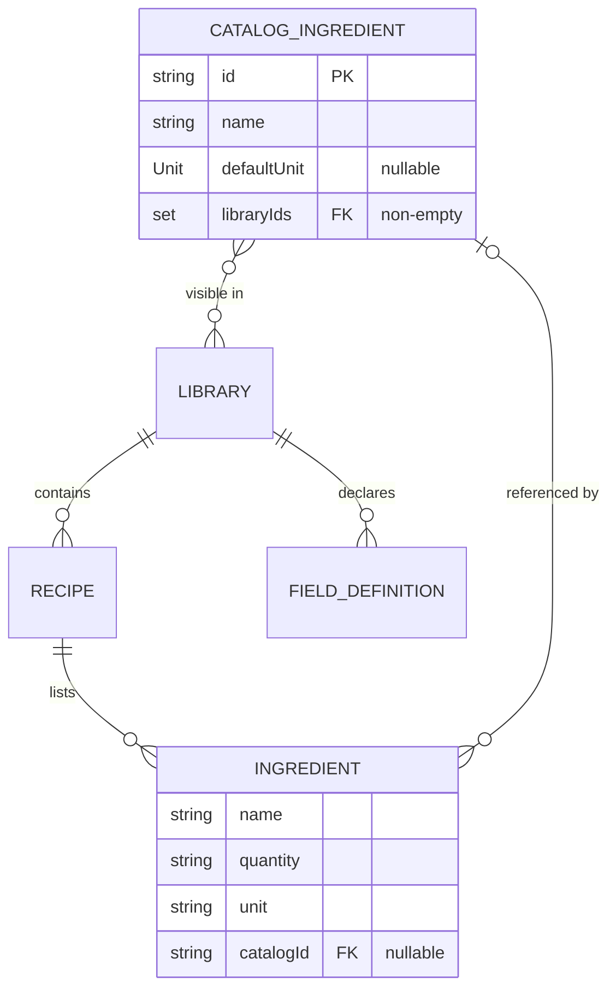

## Add ingredients catalog - Standard

> Decision record: `docs/brainstorm/2026-09-12-ingredients-catalog-brainstorm-doc.md`.
> Builds on `docs/plan/2026-08-14-feat-add-schema-driven-recipe-libraries-plan.md`, whose stack
> (`recipes_api` → `local_storage_recipes_api` → `recipes_repository` → `RecipesBloc` → forui
> screens) this plan extends rather than replaces.
> **Three PRs**, one per phase. The phase boundaries are the PR boundaries.

## Overview

Ingredients become **entities rather than typed strings**. A `CatalogIngredient` carries a name,
an optional default measurement unit, and the set of libraries it is visible in. Recipes
reference catalog entries by id, so renaming `Gin` to `London Dry Gin` propagates to every recipe
that uses it.

In the recipe editor, the ingredient row's name field becomes an autocomplete over the catalog.
Picking an entry prefills the row's unit from the entry's default; the link itself is resolved
from the row's name when the recipe is saved. A `+ New ingredient` item in the picker opens a
bottom sheet (name + default unit) and scopes the new entry to the library the recipe is being
written in — creation never asks about scope. Scope then **widens through use**: the picker lists
out-of-scope entries under a `From other libraries` section, and picking one silently adds the
active library to that entry.

A management screen handles the curation the editor cannot: rename, change the default unit, edit
the library set, and delete — refused while any recipe still references the entry. It also offers
an import that scans saved recipes for ingredient names, whenever that scan would find something.

**The row's quantity and unit stay free text.** `Ingredient.unit` remains a `String`; the entry's
default is copied in as text and can be overridden — 30 ml of gin in one recipe, 1 dash in
another, from one catalog entry.

## Problem Statement / Motivation

Every ingredient is retyped on every recipe. Nothing connects the `Gin` in a Negroni to the `Gin`
in a Martini, so there is no way to rename one, retire one, or give one a default unit. The unit
is retyped alongside the name each time, which is where `ml` and `mL` diverge.

The cheap alternative — deriving ingredient options from saved recipes, exactly as `_tagOptions`
does today in `recipe_editor_page.dart:121` via `RecipesState.libraryTags` — was considered first
and rejected in the brainstorm. It needs no new entity, no storage key and no migration, but it
offers no control: **a default unit cannot be derived from what a user happened to type**, and a
derived option cannot be renamed or retired. The default unit is the point of the feature, so a
persisted entity won.

A middle option — a persisted catalog that only assists input, copying the name into the row with
no foreign key — avoids the `Recipe` model change and every orphan question, but a rename would
then leave saved recipes behind. Referencing by id was preferred so a rename propagates.

## Proposed Solution

### Invariants

Five rules collapse most of the edge cases. Everything else is detail work.

1. **A row's link is derived from its name at save time, and stored as an id.** When the editor
   builds a recipe, a row links to the catalog entry whose name folds case-insensitively equal to
   the row's text, and to nothing otherwise. The stored `catalogId` is what survives a later
   rename; **deriving it is what keeps the form from holding a link that can go stale.** The
   editor caches no id and no name in its controllers, so picking an entry, typing its name
   exactly, and importing all converge on the same link, and hand-editing a picked row's text
   drops it — with no listener and no `setState`.
2. **The editor primes a referenced row with the entry's current name when it opens.** Without
   this, rule 1 would drop the link of an untouched row whose entry had been renamed. With it,
   the editor shows exactly what the details screen shows. Priming happens before
   `_initialSnapshot` is taken, so a rename does not open an editor that is already dirty.
3. **A referenced row renders the catalog's current name; an unreferenced one renders its own.**
   One rule, used by the details screen and the management screen alike. It is what makes a
   rename visible, and it degrades to the stored name when the id resolves to nothing.
4. **Scope is assigned from context and widened by use, never asked for.** Creation from the
   editor scopes the entry to the active library. Picking an out-of-scope entry adds the active
   library to it. Only the management screen edits `libraryIds` deliberately.
5. **Catalog writes are their own mutations, and every emission carries its mutation kind.**
   Creating `Bourbon` and then abandoning the recipe leaves `Bourbon` in the catalog — deliberate;
   the alternative is a two-phase commit across two subjects. See
   [Concurrency](#concurrency-two-mutations-in-flight) for what this costs and how it is paid.

Together, rules 1–3 mean **no orphaned `catalogId` can be written**. The one remaining path — an
entry deleted while an editor holds an unsaved pick — resolves itself, because the name no longer
matches anything and the row saves as free text. An orphan is then only reachable through a
corrupt storage blob, which the reader reports and rule 3 renders correctly.

### Architecture (unchanged; extended in place)

```text
Presentation   lib/recipes/view/, lib/recipes/widgets/   picker + create sheet
     │                                                    lib/ingredients/  management screen
     │                                                    lib/ui/  shared chrome + tokens
Business Logic lib/recipes/bloc/                          RecipesBloc (new events + getters)
     │
Repository     packages/recipes_repository/               pass-throughs
     │
Data           packages/recipes_api/                      CatalogIngredient, Unit, RecipesApi
               packages/local_storage_recipes_api/        fifth prefs key + v1→v2 migration
```

**Why not a separate `IngredientsBloc` or an `ingredients_api` package.** The delete guard needs
recipes and the catalog **together** to count usage, and `RecipesSnapshot` is a single
`BehaviorSubject` over one set of `shared_preferences` keys. A second bloc would mean two blocs
subscribed to one stream with a guard spanning both. A separate package vertical would be a
nominal boundary — `recipes_api` must depend on it anyway, since `Ingredient.catalogId`
references it — with non-atomic writes across two subjects and triple the scaffolding against a
100% coverage bar. Extending the existing stack keeps the usage count a plain derived getter on
one state object, alongside `libraryTags`.

The management screen is presentation-only and lives under `lib/ingredients/`, reading the same
`RecipesBloc`. A feature directory is not a layer. **It therefore imports
`package:membar/recipes/recipes.dart` for the bloc, its state and `RecipesMutationListener`, and
that is by design** — those are business logic and its listener, not another feature's chrome.
What it must not do is reach into `lib/recipes/widgets/` for presentation, which is why Phase 3
moves the two feature-agnostic widgets it actually needs into `lib/ui/`.

### Data model (ERD)



`CatalogIngredient` is the only new entity, and it follows the conventions the package's other
models already set: `equatable` + `json_serializable`, a uuid id generated when omitted, a
trimmed name asserted non-blank, and `Set.unmodifiable(libraryIds)`. **`libraryIds` is asserted
non-empty** — an entry in no library is reachable from no picker, so the state is made
unrepresentable rather than guarded against in three places. A `Set` is the right shape (a
library is in or out, and order carries no meaning); the management screen orders it for display
by looking each id up in `state.libraries` and sorting by name.

`Ingredient` gains one nullable field. Two details are easy to miss and both are load-bearing:
**`catalogId` must join `props`** — otherwise a linked and an unlinked row compare equal and every
equality-based test in the suite passes vacuously — and **a blank `catalogId` normalizes to
`null`** in the constructor, the way `name`, `quantity` and `unit` are already trimmed, so a
truthy-looking empty id cannot become a key in `ingredientUsage`.

### `Unit`: sealed, with a custom escape

A closed enum would contradict the documented invariant in `ingredient.dart:9-10` — `"1 dash"`
and `"to taste"` are as valid as `"2 oz"` — and a bare `String` would let `ml` and `mL` diverge,
which is the divergence this feature exists to stop.

This is the plan's **biggest complexity bet**, and worth naming as one: `label` is the only
accessor the UI needs, so the hierarchy's whole value is the JSON discriminator that keeps `ml`
and `mL` apart. The bet is that a discriminated union is cheaper than the divergence — but it is
a bet, not a settled question.

```dart
// packages/recipes_api/lib/src/models/unit.dart
/// The measurement units the app knows by name.
enum StandardUnit { ml, cl, oz, dash, drop, barspoon, teaspoon, tablespoon, gram, piece }

sealed class Unit extends Equatable {
  const Unit();
  factory Unit.fromJson(Map<String, dynamic> json) { /* see below */ }

  /// What is written into an ingredient row's unit field, such as `ml`.
  String get label;

  Map<String, dynamic> toJson();
}

final class KnownUnit extends Unit { const KnownUnit(this.unit); final StandardUnit unit; }
final class CustomUnit extends Unit { CustomUnit(String label) : ... ; final String label; }
```

The set is deliberately short. `CustomUnit` covers everything else, so adding `sprig`, `leaf` or
`cup` buys a `StandardUnit` value where a custom label already works.

Both subclasses **override `props`** (`KnownUnit(ml) == KnownUnit(ml)`, and
`KnownUnit(ml) != CustomUnit('ml')` — the discriminator is the point), and `CustomUnit` trims its
label and asserts it non-blank, matching `Ingredient`, `Library` and `Recipe`. Every public
member here carries a doc comment, `StandardUnit`'s ten values included:
`public_member_api_docs` is enabled under `packages/**`.

Encoding is explicit rather than positional, so a custom label spelled `ml` cannot be mistaken
for the known unit: `{"kind": "standard", "unit": "ml"}` and `{"kind": "custom", "label": "pinch"}`.

**An unrecognised standard unit decodes to `CustomUnit(name)` rather than throwing**, mirroring
the existing `FieldType` unknown-decodes-to-`text` precedent. It round-trips lossily — a newer
version's `KnownUnit(gill)` comes back as `CustomUnit('gill')` on an older build — which is the
right trade against a decode that loses the whole catalog.

**The `json_serializable` seam needs naming, because it is where Phase 1's codegen fights back.**
`CatalogIngredient` is generated, and `defaultUnit` is a *nullable sealed* field with hand-written
JSON. Bridge it with a `JsonConverter<Unit, Map<String, dynamic>>` applied as
`@JsonKey(fromJson:, toJson:)` on the field, and handle null explicitly at the field level: a
non-nullable converter is **not** invoked for a null value, so the field's own functions must
accept and return null rather than delegating blindly.

`defaultUnit` is nullable because ice, a garnish, and `to taste` have no unit, and forcing one
would put a meaningless `piece` on the row every time such an entry is picked.

`Unit.label` is **not localized** — it is the canonical spelling, matching how the row's free-text
unit already works, and it is what the unit selector renders. The app ships `en` only, so nothing
renders inconsistently today; localizing unit labels is recorded as a limitation rather than done
here.

### Name folding

Catalog names are unique **catalog-wide**, folded case-insensitively via the existing
`foldCaseInsensitive` / `compareCaseInsensitive` in `packages/recipes_api/lib/src/models/tags.dart`
— the same protection that stops a retyped tag sprouting a duplicate chip.

Folding is **case-only, plus a trim**, exactly as tags fold today. It does not normalise
punctuation or whitespace inside the string: `St. Germain` and `St Germain` are two entries, and
merging them is a rename on the management screen. Inventing a second, stricter folding rule for
one entity would leave the app with two notions of "the same name".

**Uniqueness is enforced in the data layer, not in a validator.** `saveIngredient` throws
`IngredientNameTakenException(name)` when the folded name already belongs to a *different* id.
Putting it anywhere else would leave three write paths — the create sheet, the rename on the
management screen, and the import — each responsible for a rule that invariant 1 depends on: it
is catalog-wide uniqueness that makes a name resolve to at most one entry. The UI still folds
before writing, so the exception is a backstop rather than the user's error message.

### Storage

A fifth key beside the four in `local_storage_recipes_api.dart:45-57`:

```dart
static const kIngredientsKey = '__ingredients_key__';
static const kSchemaVersion = 2; // was 1
```

**Migration v1 → v2 writes `__ingredients_key__ = []` and leaves recipes untouched.** No user
recipe data is rewritten on upgrade. The catalog starts empty; the management screen then offers
the import, running the scan **on demand and visibly**.

Version handling in `_restore()` becomes four cases:

| Stored version | Libraries blob | Writes |
|---|---|---|
| absent | — | seed libraries + `kIngredientsKey = []` + `kSchemaVersion = 2` |
| `1` | readable | `kIngredientsKey = []` + `kSchemaVersion = 2`; recipes and libraries untouched |
| `1` | unreadable | re-seed libraries **and** `kIngredientsKey = []`, then `kSchemaVersion = 2` |
| `2` | — | none (or the existing re-seed alone, if libraries are unreadable) |

Three ordering rules make this safe against `_persistInitial`, which **swallows a failed write**
(`local_storage_recipes_api.dart:241-249`) so the app can keep running on the in-memory snapshot:

1. **The catalog key is written only when it is absent.** A version write that fails leaves the
   install at v1 and the migration re-runs next launch; without this rule that re-run would
   overwrite a catalog the user had since built with `[]`.
2. **The version key is written last.** The insertion order of the `writes` map is the write
   order, so a partial failure leaves a v1 install with a catalog rather than a v2 install
   without one.
3. **The catalog write is decided independently of the libraries branch.** The existing re-seed
   branch already stamps `kSchemaVersionKey` (`local_storage_recipes_api.dart:139-149`), so a v1
   install whose libraries blob is unreadable would otherwise jump to v2 with the catalog key
   never written — row three of the table above.

`_readIngredients()` mirrors `_readRecipes()` exactly: a corrupt blob recovers as an empty list
through `_onRecoveryError` rather than throwing, because a bad catalog must not cost the user
their recipes. `_emit()` gains an `ingredients` parameter alongside `recipes`.

A corrupt catalog is the one way a `catalogId` can be left pointing at nothing, so `_restore()`
also calls `_reportDanglingIngredientRefs()`, the sibling of `_reportDanglingRecipes()`:
`"N ingredient row(s) reference a catalog entry that no longer exists; they are shown as typed."`
Reported, never rewritten — invariant 3 renders them correctly.

#### Every mutation is serialized

Each mutation computes its new list from `_subject.value` and then awaits the write, so two
overlapping callers can each compute from the same snapshot and have one silently overwrite the
other. Today that is nearly unreachable — `saveRecipe` and `deleteRecipe` are driven by
user-blocking UI — but the catalog adds a write the user never waits for (the silent scope widen),
which can overlap the create sheet's save on the same key.

Fix it once, in the layer that owns the problem, rather than making every caller serialize:

```dart
Future<void> _queue = Future<void>.value();

/// Runs [mutation] after every mutation already queued.
///
/// Two overlapping callers would otherwise each compute a list from the same
/// snapshot, and the second write would drop the first. Failures reach the
/// caller without stalling the queue behind them.
Future<void> _serialized(Future<void> Function() mutation) {
  final result = _queue.then((_) => mutation());
  _queue = result.then((_) {}, onError: (_, _) {});
  return result;
}
```

Every mutation body — the existing two included — moves inside `_serialized`, and so does
`_persistInitial`. That last one matters: the api is usable before its initial write completes
(`local_storage_recipes_api.dart:70-77`), so without it the migration's `kIngredientsKey = []`
can overtake a `saveIngredient` dispatched moments after launch and wipe the entry it just wrote.
Queueing the initial write first makes the ordering the one the constructor already implies.

This is a small, self-contained hardening of code the plan already has to touch.

### API surface

```dart
// packages/recipes_api/lib/src/recipes_api.dart
Future<void> saveIngredient(CatalogIngredient ingredient);   // Phase 1
Future<void> deleteIngredient(String id);                    // Phase 1
Future<void> saveIngredients(List<CatalogIngredient> ingredients); // Phase 3, with the import
```

`saveIngredient` creates or replaces by id, and throws `IngredientNameTakenException(name)` on a
folded collision with a different id. `saveIngredients` lands **with its only caller in Phase 3**
rather than shipping two PRs ahead of it: it exists so importing 40 entries is one blob rewrite
and one snapshot emission instead of 40 of each, and it carries its own coverage burden, so there
is no reason for Phase 1 to hold it.

`deleteIngredient` throws `IngredientNotFoundException(id)` when no such entry exists and
`IngredientInUseException(id, recipeCount)` when any recipe references it.

**The delete guard is a backstop, not the user's error path.** The management screen refuses
before dispatching, reading the count straight from `ingredientUsage`, which is how the refusal
can name it (`"Gin is used in 4 recipes"`) — a bare `mutationStatus.failure` cannot distinguish
"in use" from "the write failed". The data-layer guard exists because it is the only place with
no window between the check and the write, and it is tested at its own layer. If it ever fires,
the screen shows the generic delete-failure message.

`RecipesRepository` gains pass-throughs, following the existing shape exactly.

### Bloc surface

```dart
// events
RecipesIngredientSaved(CatalogIngredient ingredient)
RecipesIngredientDeleted(String id)
RecipesIngredientScopeWidened(String ingredientId, String libraryId)
RecipesIngredientsImported()                                    // Phase 3

// RecipesMutation gains
ingredientSaved, ingredientDeleted, ingredientsImported
```

`ingredientSaved`, `ingredientDeleted` and `ingredientsImported` are `sequential()` and report
through `mutation` / `mutationStatus` like the existing mutations.

**Name the catch in every handler.** `RecipesBloc` catches typed exceptions explicitly
(`recipes_bloc.dart:69,88,93`), and a missed one is not cosmetic: the handler throws, no state is
emitted, and `mutationStatus` is stranded on `loading` with the user watching a spinner forever.
`_onIngredientSaved` catches `IngredientNameTakenException` and `RecipesPersistenceException`;
`_onIngredientDeleted` catches `IngredientNotFoundException`, `IngredientInUseException` and
`RecipesPersistenceException`; `_onIngredientsImported` catches `IngredientNameTakenException` and
`RecipesPersistenceException`. Each emits `failure`.

**Scope widening reports nothing.** Its handler calls `saveIngredient` and swallows the
exception; it never touches `mutation` or `mutationStatus`. Nothing in the UI branches on the
outcome of a write the user did not ask for, and a mutation kind that exists only so other
listeners can ignore it is machinery serving no reader. A failed widen leaves the entry out of
scope until the next pick, and the row is unaffected — the link is by name, so it does not depend
on scope at all. This makes "a failed widen changes nothing on screen" true by construction
rather than by a UI that ignores a state it is tracking.

`RecipesState` gains `ingredients` plus four derived members in Phase 1, sitting alongside
`libraryTags`, and a fifth (`importableIngredients`) in Phase 3:

```dart
/// Catalog entries visible in the active library, ordered case-insensitively.
List<CatalogIngredient> get libraryIngredients;

/// Catalog entries not visible in the active library — the picker's second section.
List<CatalogIngredient> get otherLibraryIngredients;

/// How many recipes reference each entry, keyed by catalog id. Absent means zero.
Map<String, int> get ingredientUsage;

/// The entry carrying [id], or null when it resolves to nothing.
CatalogIngredient? ingredientById(String id);
```

`ingredientUsage` is a **map**, computed in one pass, rather than a per-id method — the management
screen renders one row per entry, and a per-row count would be O(entries × recipes). It is a
plain getter, not a `late final` field, so `RecipesState`'s `const` constructor survives; that
means it recomputes on every access, so **the screen hoists it into a local once per build**, or
the cost it was written to avoid comes straight back.

It counts **distinct recipes across all libraries**: a recipe listing an entry on two rows counts
once, and deletion is global so the count must be too.

#### Concurrency: two mutations in flight

`mutation` and `mutationStatus` are a single slot, and `sequential()` serializes only within one
event type. An ingredient write completing during an in-flight recipe save would otherwise emit
`copyWith(mutationStatus: success)` onto whatever `mutation` the slot happens to hold — and
`RecipesMutationListener` would pop the editor over a recipe that never saved.

**Every emission carries its own mutation kind**, including the terminal ones:

```dart
emit(state.copyWith(mutation: RecipesMutation.recipeSaved,
                    mutationStatus: RecipesMutationStatus.success));
```

The existing three handlers are updated to match. Each listener then sees its own pair whatever
the interleaving, because `RecipesMutationListener` already filters on `state.mutation`. This is
covered by a `blocTest` that interleaves a recipe save and an ingredient save and asserts that
every emitted state's `mutation` matches the handler that emitted it.

One residual is accepted: the editor's `saving` selector (`recipe_editor_page.dart:151-155`)
reads false for the frames another mutation owns the slot, so its save action re-enables briefly.
The create sheet is a modal route above the editor, so the button cannot be tapped while a catalog
write from the editor is in flight.

The create sheet (Phase 2) and the edit sheet (Phase 3) share `RecipesMutation.ingredientSaved`.
That is safe because they are never open at once — worth stating, since the plan makes a point of
giving scope-widening no kind at all to avoid exactly this sort of confusion.

### The picker

`FAutocomplete` — not `FSelect` — because free-text rows stay first-class. The field remains a
text field the user can type anything into; the catalog is a suggestion list over it. This is
also what keeps the editor's hand-rolled dirty check working: `FAutocompleteController` extends
`FTypeaheadController` extends `TextEditingController`, so `IngredientRowControllers.name` changes
type without changing how it is read.

This settles the brainstorm's first open question — the picker gets search, and nothing has to be
built to give it one. Verified against the pinned `forui 0.24.1` source, not the docs:
`FAutocomplete<T>.builder({format, parse, filter, contentBuilder, control, onItemPress})`,
`FAutocompleteSection` for the `From other libraries` heading, and `FAutocompleteItem.raw` for the
create action. Pressing an item sets the field text to `format(value)` and *then* calls
`onItemPress(value)`.

Two option kinds, no more — `parse` is only consulted for `validator` and `onSaved`
(`autocomplete.dart:1451-1453`), neither of which this field uses, so there is no third
"free text" value for it to produce. Both are `Equatable` with `const` constructors, like every
other value type in the repo:

```dart
// lib/recipes/widgets/ingredient_picker.dart
sealed class IngredientOption extends Equatable {}
final class CatalogOption extends IngredientOption { final CatalogIngredient entry; }
final class CreateOption  extends IngredientOption { final String query; }
```

`format` maps `CreateOption` back to the **query the user typed**, so pressing `+ New ingredient`
leaves the field exactly as typed while the sheet opens over it. Without this, the create item
would stamp its own label into the name field — the one real trap in this widget.

**`contentBuilder`, not `filter`, appends the create item.** `Content._content` shows
`emptyBuilder` when the *builder* returns no children (`autocomplete_content.dart:86-89`), so
building the create item from the filter's results would make it vanish on an empty catalog —
precisely the fresh install the migration guarantees. Appending it in `contentBuilder` means the
content is never empty and the create path always exists.

`filter(query)` returns matching in-scope entries then matching out-of-scope entries, reading
`context.read<RecipesBloc>().state` **at call time**. Filtering runs per keystroke, so the list is
always current — a just-created entry is offered to the next row immediately — without a
subscription that could reshuffle the popover under a finger mid-tap. Matching is `contains`,
case-insensitive, not `startsWith`: typing `vermouth` should find `Dry Vermouth`.

`onItemPress`:

| Option | Effect |
|---|---|
| `CatalogOption` in scope | prefill the unit |
| `CatalogOption` out of scope | prefill the unit, and dispatch `RecipesIngredientScopeWidened` |
| `CreateOption` | open the create sheet prefilled with the query; on return, prefill the unit |

Nothing stamps an id — invariant 1 resolves the link from the name at save. This is why the row
controllers gain **no new controllers**, why the dirty check needs no new entry, and why the
editor needs no listener on the catalog.

**Unit prefill overwrites the row's unit only when it is empty, or when it still holds the
previously-picked entry's default.** A unit the user typed themselves is never clobbered, and
re-picking after choosing the wrong entry still corrects the unit. An entry with a null
`defaultUnit` clears nothing. Remembering the previous default needs one `String? _prefilledUnit`
field on the picker widget's state — plain state, not a controller, so `dispose()` is unchanged.

### The create sheet

`showFSheet<CatalogIngredient>(side: FLayout.btt, …)` pushes a route, so the editor never
unmounts and its controllers and dirty check are untouched — the reason the brainstorm chose a
sheet over a pushed page. Like `RecipeEditorPage.route`, it must re-provide the bloc with
`BlocProvider.value`, since the sheet's route sits above the provider.

Contents, padded from `AppInsets.sheetContent` (a new entry beside `dialogContent`, so two sheets
cannot end up padded differently): a name field prefilled with the typed query, a unit selector,
and a save action. It dispatches `RecipesIngredientSaved` and watches
`RecipesMutation.ingredientSaved` through the existing `RecipesMutationListener`, popping with the
entry on success and showing an inline `FailureBanner` on failure — the sheet stays open, so
nothing typed is lost. Dismissing it, by the cancel action or a drag, returns null and leaves the
row's text exactly as typed.

The unit selector is `FSelect<StandardUnit>` rendering each value's `label`, plus a `Custom…`
escape that reveals a text field.

**A name that folds onto an existing entry reuses that entry rather than creating a second.** It
is widened to the active library if it is not already in scope and returned to the row, which is
the same act the picker performs for an out-of-scope pick — and because it saves the existing
id, it never trips the data layer's uniqueness guard. Refusing with an error instead would be a
dead end for the common case: a user who did not notice the entry under `From other libraries`.
So that the reuse is never a surprise, **the sheet's unit selector switches to the existing
entry's default as soon as the typed name folds onto one**, with a note naming the entry; the user
sees what they are about to get before saving.

## Technical Considerations

### What this does *not* change

- `Ingredient.name`, `quantity` and `unit` stay `String`. No recipe rewrite, no row-render change.
- `Ingredient.catalogId` is nullable, so **every existing recipe decodes unchanged** — this is
  what lets the migration leave recipes alone.
- Free-text rows keep working with the catalog empty. The picker with no entries shows only
  `+ New ingredient`, and a row typed and never picked is exactly what it is today.
- A row with a blank name is still dropped at save, as today. It has no link either, so nothing
  new is lost with it.

### The five plumbing sites

`ingredients` has to be threaded through `RecipesSnapshot`, `_emit`, `RecipesState.copyWith`,
`RecipesState.props`, and the bloc's `emit.forEach` `onData`. **A missing `onData` line drops the
catalog on every snapshot and no existing test fails**, so Phase 1 carries an explicit `blocTest`
asserting that a snapshot's ingredients reach the state.

`RecipesSnapshot`'s fields are all `required` and the new one follows suit, which breaks every
construction site: `recipes_snapshot_test.dart`, `recipes_repository_test.dart`,
`recipes_bloc_test.dart`, **`test/app/view/app_test.dart` and
`test/recipes/view/recipes_page_test.dart`**. The last two are easy to miss; all five are listed
in Phase 1.

### Spacing tokens

`docs/known-issues.md` carries an open entry: `lib/ui/app_spacing.dart` names the scale but only
the confirm dialog reads from it. This plan adds four widgets and a feature directory, so written
with fresh `spacing: 8` literals it would widen that issue rather than hold the line. **Every new
widget uses `AppSpacing` steps**, and Phase 3 — which already moves the one file that uses the
tokens — adds `AppInsets.sheetContent`. Sweeping the *existing* screens stays out of scope; this
plan only declines to add to the pile.

### Risks

- **The picker is the risk.** It is the first `FAutocomplete` in the repo, it carries a sealed
  option type, two sections, a create action, a scope side effect and a conditional unit prefill —
  against a 100% coverage bar. PR2 exists to hold that work in its own review.
- **forui 0.24.1 is pinned exactly** (`pubspec.yaml:20-23`) and every API above was read from the
  resolved source in the pub cache. Two behaviours this design leans on are implementation, not
  contract: `onItemPress` firing after the text mutation, and `emptyBuilder` keying off the
  content builder's output. A forui bump must re-verify both.
- **`shared_preferences` scaling** is unchanged and unchanged-for-the-worse: the catalog is a
  fifth whole-blob rewrite. The `RecipesApi` seam still lets a real database replace it.
- **Library deletion is unbuilt** (deferred to PR2 of the schema-driven libraries plan). When it
  lands, it must not empty an entry's `libraryIds` — the model asserts against it.

### Known Limitations (add to `docs/known-issues.md` in Phase 3)

- Library deletion, when it is built, cannot simply drop the id from every entry's `libraryIds`:
  the model asserts the set is non-empty. Whoever builds it must decide between refusing the
  library deletion and reassigning the entries.
- `Unit.label` is not localized. The app ships `en` only.
- Name folding is case-and-trim only; `St. Germain` and `St Germain` remain two entries.
- The import creates entries only. A saved recipe's rows link to them the next time that recipe is
  saved, because invariant 1 resolves the link from the name — there is no bulk backfill.
- `"used in 4 recipes"` counts every library, including ones the user is not browsing, so the
  recipes behind a refused delete may not all be visible from where they are standing.

## Implementation Phases

Phase boundaries are PR boundaries. The codebase compiles and its tests pass after each.

**Scope note.** ~1,400–1,900 LOC including tests at 100% coverage. Phase 1 is invisible to the
user and reviewable purely on data modelling. Phase 2 is the editor surface and the only phase
with real interaction risk — the largest of the three, and the one to staff with extra review
attention. Phase 3 is a screen, but **not** a presentation-only phase: it carries the import,
which reaches from a new state getter down through the bloc, the repository and both data
packages, plus the relocation of two shared widgets. Read it as the third-largest, not the small
one. Splitting into three part-N files was considered and rejected: the data model and the five
invariants are shared by all three, and duplicating them across files is how they drift.

**On running the test suite.** A repo hook routes `very_good test` through the very_good_cli MCP
`test` tool rather than the shell. Run the coverage gate through that tool with
`min_coverage: 100`; the `verify:` commands below use the plain test runners so they are
shell-executable, and coverage has its own criterion.

### Phase 1 (PR1): data layer

- **Status:** Done
- **Ships nothing user-visible.** That is the acknowledged cost of the split, and it buys a
  reviewable data-modelling PR.
- **Scope:** `CatalogIngredient`, the sealed `Unit` type with its converter,
  `Ingredient.catalogId`, `RecipesSnapshot.ingredients`, the `__ingredients_key__` key with
  per-key corruption recovery, the v1 → v2 migration, `_reportDanglingIngredientRefs`, mutation
  serialization, `saveIngredient` / `deleteIngredient` plus the three new exceptions, the
  repository pass-throughs, and the bloc's three events, two mutation kinds, four derived state
  members and the emit-your-own-mutation-kind fix to the existing handlers.
- **Files touched:**
  - `packages/recipes_api/lib/src/models/{unit.dart,catalog_ingredient.dart}` (new),
    `.../models/{ingredient.dart,recipes_snapshot.dart,models.dart}`,
    `.../lib/src/recipes_api.dart`, generated `*.g.dart` (committed)
  - `packages/local_storage_recipes_api/lib/src/local_storage_recipes_api.dart`
  - `packages/recipes_repository/lib/src/recipes_repository.dart`
  - `lib/recipes/bloc/{recipes_bloc.dart,recipes_event.dart,recipes_state.dart}`
  - tests: `packages/recipes_api/test/src/models/{unit_test.dart,catalog_ingredient_test.dart}`
    (new), `.../models/{ingredient_test.dart,recipes_snapshot_test.dart}`;
    `packages/local_storage_recipes_api/test/src/local_storage_recipes_api_test.dart`;
    `packages/recipes_repository/test/src/recipes_repository_test.dart`;
    `test/recipes/bloc/**`; **`test/app/view/app_test.dart`**,
    **`test/recipes/view/recipes_page_test.dart`** (both construct `RecipesSnapshot`);
    `test/helpers/fixtures.dart` (catalog fixtures)
- **Acceptance criteria:** `CatalogIngredient` round-trips including a null, known and custom
  `defaultUnit` and a multi-library `libraryIds`; ids auto-generate; a blank name asserts; an
  empty `libraryIds` asserts; its collections are unmodifiable; `Unit` round-trips both kinds, an
  unrecognised standard name decodes to `CustomUnit`, `KnownUnit(ml) == KnownUnit(ml)`,
  `KnownUnit(ml) != CustomUnit('ml')`, and a blank `CustomUnit` asserts; every public member in
  the package carries a doc comment; an `Ingredient` JSON blob written before this change decodes
  with `catalogId == null`, a blank `catalogId` normalizes to null, and `catalogId` is in `props`;
  a fresh install writes the catalog key before the version key and lands at version 2; a stored
  version `1` gains an empty catalog **without rewriting recipes or libraries** (assert the
  recipes blob is byte-identical); a v1 install with a corrupt libraries blob re-seeds **and**
  still writes the catalog key; a migration finding the catalog key already present does not
  overwrite it; a stored version `2` writes nothing; a corrupt catalog blob recovers as empty
  through `onRecoveryError` while leaving recipes intact; dangling `catalogId`s are reported and
  kept; two overlapping mutations both land, a failed one does not stall the ones queued behind
  it, and a mutation dispatched before the initial write completes lands **after** it rather than
  being overwritten by the migration; `saveIngredient` creates and replaces by id, re-emits, and throws
  `IngredientNameTakenException` on a folded collision with a different id but **not** when
  replacing the same id; `deleteIngredient` throws `IngredientNotFoundException` for an unknown id
  and `IngredientInUseException` carrying the count when a recipe references it, **including when
  that recipe is in another library**; `libraryIngredients` / `otherLibraryIngredients` partition
  on the active library and sort case-insensitively; `ingredientUsage` counts distinct recipes
  across all libraries and counts a recipe using the same entry on two rows as **one**;
  `ingredientById` returns null for an unknown id; a snapshot's ingredients reach the state
  through `onData`; each handler emits `failure` rather than throwing for every exception its
  repository call declares; every emission from every mutation handler carries its own mutation
  kind, proven by a `blocTest` interleaving a recipe save and an ingredient save; a failed scope
  widen emits no mutation state at all; 100% coverage in all four units.
- **Validation:** `(cd packages/recipes_api && dart pub get && dart run build_runner build --delete-conflicting-outputs && dart analyze && dart test) && (cd packages/local_storage_recipes_api && flutter pub get && flutter analyze && flutter test) && (cd packages/recipes_repository && dart pub get && dart analyze && dart test) && flutter analyze && flutter test`, then the very_good_cli MCP `test` tool at `min_coverage: 100` for the root and each package.

### Phase 2 (PR2): picker and create sheet

- **Status:** Not started
- **This is the PR that answers the original complaint.**
- **Scope:** `IngredientRowField`'s name field becomes the catalog picker; the editor resolves
  each row's link from its name at save and primes referenced rows with the entry's current name
  at open; the create sheet; the details screen renders the catalog's current name for referenced
  rows.
- **Files touched:** `lib/recipes/widgets/ingredient_picker.dart` (new — the option type, filter
  and content builder), `lib/recipes/widgets/ingredient_create_sheet.dart` (new),
  `lib/recipes/widgets/ingredient_row_field.dart`,
  `lib/recipes/view/{recipe_editor_page.dart,recipe_details_page.dart}`,
  `lib/recipes/recipes.dart`, `lib/ui/app_spacing.dart` (`AppInsets.sheetContent`),
  `lib/l10n/arb/app_en.arb`; tests
  `test/recipes/widgets/{ingredient_picker_test.dart,ingredient_create_sheet_test.dart,ingredient_row_field_test.dart}`,
  `test/recipes/view/{recipe_editor_page_test.dart,recipe_details_page_test.dart}`
- **New ARB keys:** the picker's `+ New ingredient` and `From other libraries`, the unit
  selector's `Custom…` and its label, and the create sheet's title, name label, save action and
  reuse note (placeholder: the existing entry's name).
- **Acceptance criteria:** the picker lists in-scope entries first and out-of-scope entries under
  a `From other libraries` section, shows neither heading when its section is empty, and matches
  case-insensitively on `contains`; a saved row links to the entry whose name it matches whether
  that name was picked, typed exactly, or completed by the typeahead; hand-editing a picked row's
  name drops the link; opening a recipe whose entry was renamed shows the new name, keeps the link
  on save, and does not open the editor dirty; an entry deleted while the editor holds an unsaved
  pick saves as free text rather than an orphan; the same entry can be linked from two rows of one
  recipe; picking prefills the unit only when the unit field is empty or still holds the previous
  pick's default; picking an out-of-scope entry dispatches `RecipesIngredientScopeWidened`, and a
  failed widen emits no mutation state and changes nothing on screen; `+ New ingredient` is
  present with an empty catalog, leaves the typed text in place, and opens the sheet prefilled
  with it; the sheet persists an entry scoped to the active library, returns it to the row, and
  leaves the entry in the catalog when the recipe is then abandoned; a typed name that folds onto
  an existing entry switches the sheet's unit selector to that entry's default and saves as a
  reuse-and-widen rather than a second entry; a save failure keeps the sheet open with a banner
  and the typed values intact; a dismissed sheet leaves the row's text as typed; details renders
  the catalog's current name for a referenced row and the stored name for an unreferenced or
  unresolvable one; new widgets take their gaps from `AppSpacing`; 100% coverage. Widget tests
  drive a `MockBloc`, not a real `RecipesBloc`, and closing the create sheet disposes its
  controllers, asserted with `LeakTesting.settings.withTrackedAll()` as the removed-row test
  already does.
- **Validation:** `flutter pub get && flutter gen-l10n && flutter analyze && flutter test`, then
  the very_good_cli MCP `test` tool at `min_coverage: 100`.

### Phase 3 (PR3): management screen

- **Status:** Not started
- **Scope:** the catalog list and its navigation entry, the edit sheet (name, default unit,
  library set), delete with the usage guard, the import, and `saveIngredients`. Moves the two
  feature-agnostic widgets `lib/ingredients/` needs — `confirm_dialog.dart` (renamed
  `showConfirmDialog`, since "Recipe" is wrong once ingredients call it) and
  `failure_banner.dart` — from `lib/recipes/widgets/` to `lib/ui/`.
  `recipe_section_title.dart` stays put: a list screen has no sections, so moving it would be
  speculation.
- **Files touched:** `lib/ingredients/{ingredients.dart,view/ingredients_page.dart,view/ingredients_view.dart,widgets/ingredient_editor_sheet.dart}`
  (new), `lib/recipes/view/recipes_view.dart` (second header action),
  `lib/ui/{confirm_dialog.dart,failure_banner.dart}` (moved) + `lib/ui/ui.dart`,
  the two originals under `lib/recipes/widgets/` (deleted) + `lib/recipes/recipes.dart`,
  the call sites that follow the rename — `recipe_editor_page.dart:310`,
  `recipe_details_page.dart`, `recipes_view.dart` and the Phase 2 sheet —
  `packages/recipes_api/lib/src/recipes_api.dart` and
  `packages/local_storage_recipes_api/...` (`saveIngredients`),
  `packages/recipes_repository/lib/src/recipes_repository.dart`,
  `lib/recipes/bloc/{recipes_bloc.dart,recipes_state.dart}`, `lib/l10n/arb/app_en.arb`,
  `docs/known-issues.md`; tests `test/ingredients/**`, `test/ui/**` (moved from
  `test/recipes/widgets/`), `test/recipes/view/{recipes_view_test.dart,recipe_details_page_test.dart}`,
  `test/recipes/bloc/recipes_state_test.dart`, and the two package test files
- **The import** is a derived getter, `RecipesState.importableIngredients`, so it is reachable
  from a `blocTest` rather than only through a screen — the same reasoning that put `libraryTags`
  on the state. It folds distinct row names that no catalog entry already claims, scopes each
  entry to the union of the libraries of the recipes using that name, and infers a `defaultUnit`
  from the most frequent non-blank unit spelling on those rows (first-seen wins a tie), mapping to
  `KnownUnit` when the spelling matches a `StandardUnit` case-insensitively and `CustomUnit`
  otherwise.
  **The getter returns an id-free value type**, `ImportableIngredient(name, defaultUnit,
  libraryIds)`, and `RecipesIngredientsImported` mints the ids at write time. A getter returning
  `CatalogIngredient`s would generate fresh uuids on every access, so
  `state.importableIngredients != state.importableIngredients`, the screen would render one set of
  ids and the dispatch would write another, and no `blocTest` could name the result.
  The write goes through `saveIngredients` — one blob, one emission. **It never rewrites a saved
  recipe.** It is idempotent rather than one-time — nothing persists an "imported" flag, and the
  getter excludes names the catalog already covers — so the action is offered whenever it would do
  something, on the empty state and above a non-empty list alike.
- **New ARB keys:** the screen title and header action label, the list's per-entry usage count
  (ICU `plural` — `1 recipe` / `4 recipes`), the delete refusal, the edit sheet's title and
  library-set label, the empty state, and the import action with its count (a second ICU
  `plural`). These are the repo's first plural messages; `app_en.arb` has no precedent to copy.
- **Acceptance criteria:** the recipe list header carries a second action that pushes the screen,
  and the screen renders under the pushed route with the bloc re-provided; the list shows every
  entry with its default unit, its libraries ordered by library name, and its usage count read
  from a single hoisted `ingredientUsage`; editing a name propagates to the details screen of a
  recipe referencing it; a rename that folds onto another entry is refused by the same rule as
  creation, and `saveIngredient` throws if one ever reaches it; editing the library set moves an
  entry between the picker's two sections, and clearing it is refused; delete is refused for an
  entry in use with a message naming the count — read from `ingredientUsage`, before dispatching —
  and succeeds at zero, behind the shared confirm dialog; two reads of `importableIngredients` are
  equal; it is empty when the catalog already covers every name, folds `Gin`/`gin` to one entry,
  unions libraries across recipes, and infers the modal unit; importing writes one blob and one
  emission and leaves recipes untouched; the import action is offered only when there is something
  to import; the moved widgets' tests move with them and every call site compiles under the new
  name; new widgets take their gaps from `AppSpacing` and the sheets from `AppInsets.sheetContent`;
  100% coverage. Widget tests drive a `MockBloc`, and closing the edit sheet disposes its
  controllers under `LeakTesting.settings.withTrackedAll()`.
- **Validation:** `flutter pub get && flutter gen-l10n && flutter analyze && flutter test`, then
  the very_good_cli MCP `test` tool at `min_coverage: 100`.

## Success Criteria

```success-criteria
GOAL: Membar gains a managed ingredients catalog — persisted CatalogIngredient entries with a sealed default Unit and a library scope that is assigned from context and widened by use — linked from recipes through a nullable Ingredient.catalogId that the editor resolves from the row's name, offered in the recipe editor as an autocomplete picker with an inline create sheet, and curated on a management screen whose delete is refused while recipes still use the entry.

SUCCESS CRITERIA:
- Static analysis is clean across the app and all three packages, with public_member_api_docs satisfied in the packages | verify: flutter analyze && (cd packages/recipes_api && dart analyze) && (cd packages/local_storage_recipes_api && flutter analyze) && (cd packages/recipes_repository && dart analyze)
- Code is formatted | verify: dart format --output=none --set-exit-if-changed .
- Bloc lints pass | verify: dart run bloc_tools:bloc lint .
- Localized strings generate cleanly, and the two plural messages compile | verify: flutter gen-l10n && flutter analyze
- recipes_api: CatalogIngredient round-trips with a null, known and custom defaultUnit and a multi-library libraryIds, ids auto-generate, a blank name and an empty libraryIds assert, Unit round-trips both kinds with an unrecognised standard name decoding to CustomUnit and with KnownUnit(ml) != CustomUnit('ml'), a blank CustomUnit asserts, and an Ingredient blob written without catalogId decodes with catalogId null, normalizes a blank one to null, and carries catalogId in props | verify: cd packages/recipes_api && dart run build_runner build --delete-conflicting-outputs && dart analyze && dart test
- local_storage_recipes_api: a fresh install writes the catalog key before the version key and lands at version 2, a stored version 1 gains an empty catalog without rewriting recipes or libraries, a v1 install with a corrupt libraries blob re-seeds and still writes the catalog key, a migration finding the catalog key present does not overwrite it, a stored version 2 writes nothing, a corrupt catalog blob recovers as empty through onRecoveryError while leaving recipes intact, dangling catalogIds are reported and kept, two overlapping mutations both land and a failed one does not stall the queue, a mutation dispatched before the initial write lands after it rather than being overwritten by the migration, saveIngredient creates and replaces by id and throws IngredientNameTakenException only on a collision with a different id, saveIngredients performs one write and one emission, and deleteIngredient throws IngredientNotFoundException for an unknown id and IngredientInUseException carrying the count for one in use in any library | verify: cd packages/local_storage_recipes_api && flutter test
- recipes_repository: saveIngredient, saveIngredients and deleteIngredient delegate to the injected RecipesApi | verify: cd packages/recipes_repository && dart test
- App, bloc and widget tests pass, covering: libraryIngredients/otherLibraryIngredients partitioning and ordering; ingredientUsage counting distinct recipes across all libraries and counting one recipe that uses an entry twice as one; ingredientById returning null for an unknown id; a snapshot's ingredients reaching the state through onData; every handler emitting failure rather than throwing for each exception its repository call declares; every emission carrying its own mutation kind under an interleaved recipe save and ingredient save; a failed scope widen emitting no mutation state; the picker's two sections, case-insensitive contains matching, and a create item present on an empty catalog; a row linking whether its name was picked, typed exactly, or typeahead-completed, and unlinking when hand-edited; a renamed entry's recipe opening with the new name, keeping its link on save, and not opening dirty; an entry deleted under an unsaved pick saving as free text; unit prefill only over an empty or previously-prefilled unit; the create sheet persisting, returning the entry, surviving an abandoned recipe, reusing-and-widening a folded duplicate with its unit shown, keeping a failure banner, and leaving the row's text on dismiss; details rendering the catalog's current name for a referenced row and the stored name otherwise; two reads of importableIngredients being equal; the management screen's list, rename propagation, refused folded rename, library-set edit, refused empty library set, usage-guarded delete, and the import's folding, library union and unit inference | verify: flutter test
- Sheet and row controllers are disposed, proven rather than read | verify: grep -rq "withTrackedAll" test/recipes/widgets && grep -rq "withTrackedAll" test/ingredients
- Coverage is 100% in the app and all three packages | verify: manual 1) run the very_good_cli MCP `test` tool with min_coverage 100 at the repo root 2) run it again for each of packages/recipes_api, packages/local_storage_recipes_api and packages/recipes_repository 3) confirm all four report 100%
- The catalog is a separate storage key and the schema version is 2 | verify: grep -q "__ingredients_key__" packages/local_storage_recipes_api/lib/src/local_storage_recipes_api.dart && grep -q "kSchemaVersion = 2" packages/local_storage_recipes_api/lib/src/local_storage_recipes_api.dart
- The two feature-agnostic widgets now live in lib/ui and the confirm dialog is no longer recipe-named | verify: test -f lib/ui/confirm_dialog.dart && test -f lib/ui/failure_banner.dart && test ! -f lib/recipes/widgets/confirm_dialog.dart && test ! -f lib/recipes/widgets/failure_banner.dart && ! grep -rq "showRecipeConfirmDialog" lib test
- The ingredients feature reaches the bloc through the recipes barrel and nothing deeper | verify: ! grep -rq "package:membar/recipes/widgets/\|package:membar/recipes/view/\|package:membar/recipes/bloc/" lib/ingredients/
- Presentation never imports a data package directly | verify: ! grep -rq "package:local_storage_recipes_api\|package:recipes_api" lib/recipes lib/ingredients lib/app lib/ui
- A catalog survives an app restart, and an upgrade from schema v1 keeps every recipe | verify: manual 1) check out main and run `flutter run --flavor development --target lib/main_development.dart`, add a cocktail with two ingredient rows, and fully kill the app 2) check out this branch and run it again 3) confirm both libraries and the cocktail are intact and every ingredient row reads exactly as before 4) open the cocktail for editing, type `gin` in an ingredient row and pick `+ New ingredient`, confirming the typed text stays put 5) create `Gin` with a default unit of `ml` and confirm the row's unit fills in with `ml` 6) save, then add a second recipe and confirm `Gin` is offered in the picker with its unit 7) switch to Coffee, open a recipe, and confirm `Gin` appears under `From other libraries`; pick it 8) switch back and open the management screen, confirming `Gin` now lists both libraries 9) rename `Gin` to `London Dry Gin` and confirm both saved recipes show the new name on their details screens 10) try to delete it and confirm the refusal names the number of recipes 11) fully kill and relaunch the app, confirming the catalog and both recipes are intact

VERIFICATION COMMAND: (cd packages/recipes_api && dart pub get && dart run build_runner build --delete-conflicting-outputs && dart analyze && dart test) && (cd packages/local_storage_recipes_api && flutter pub get && flutter analyze && flutter test) && (cd packages/recipes_repository && dart pub get && dart analyze && dart test) && flutter pub get && flutter gen-l10n && dart format --output=none --set-exit-if-changed . && flutter analyze && dart run bloc_tools:bloc lint . && flutter test
```

## Success Metrics

- An ingredient is entered once. Adding a second recipe that uses `Gin` requires typing three
  letters and picking, and its unit arrives with it.
- A rename reaches every recipe that references the entry, with no recipe data rewritten.
- Upgrading from schema v1 rewrites **zero** bytes of recipe data — provable by comparing the
  recipes blob before and after.
- 100% line coverage across the app and all three packages, unchanged from today.

## Dependencies & Risks

- **forui 0.24.1, pinned exactly.** `FAutocomplete`, `FAutocompleteSection`,
  `FAutocompleteItem.raw`, `FAutocompleteController`, `FSelect` and `showFSheet` were all read
  from the resolved source in the pub cache, not from forui.dev, which documents a newer version.
  A bump is its own PR and must re-verify the two implementation behaviours named under Risks.
- **`shared_preferences`** gains a fifth whole-blob key. Same O(n)-per-save ceiling as today.
- **Library deletion does not exist yet**, so `libraryIds` cannot currently be emptied. The
  model's assertion turns that into a constraint the schema-driven libraries PR2 must design for.
- **No golden tests.** The repo has no golden infrastructure and standing it up belongs in its own
  slice; the picker and sheet are covered behaviourally.

## References & Research

- Decision record: `docs/brainstorm/2026-09-12-ingredients-catalog-brainstorm-doc.md`
- Preceding plan whose stack this extends:
  `docs/plan/2026-08-14-feat-add-schema-driven-recipe-libraries-plan.md`
- Patterns mirrored: `packages/recipes_api/lib/src/models/tags.dart` (folding and ordering),
  `local_storage_recipes_api.dart:204-232` (per-key recovery, dangling reporting),
  `lib/recipes/bloc/recipes_state.dart:97-101` (`libraryTags` as the derived-getter precedent),
  `lib/recipes/widgets/recipes_mutation_listener.dart` (per-screen mutation routing),
  `lib/recipes/widgets/confirm_dialog.dart` (the shared-dialog helper shape),
  `test/flutter_test_config.dart` (suite-wide leak tracking)
- forui 0.24.1 source (verified locally):
  `~/.puro/shared/pub_cache/hosted/pub.dev/forui-0.24.1/lib/src/widgets/` —
  `autocomplete/{autocomplete.dart,autocomplete_item.dart,autocomplete_content.dart,autocomplete_controller.dart}`,
  `sheet/modal_sheet.dart`, `select/single/select.dart`
- VGV layered architecture — `layered-architecture` skill; bloc conventions — `bloc` skill
